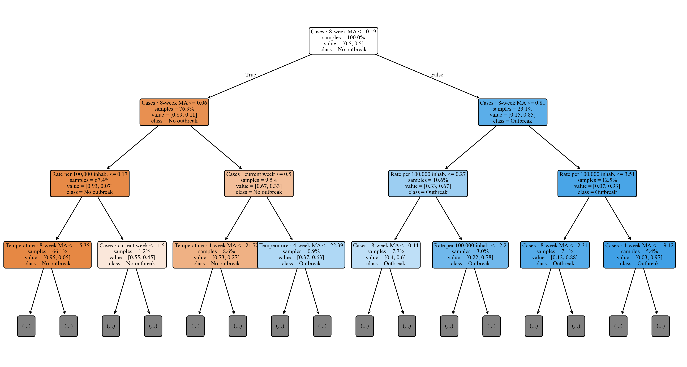
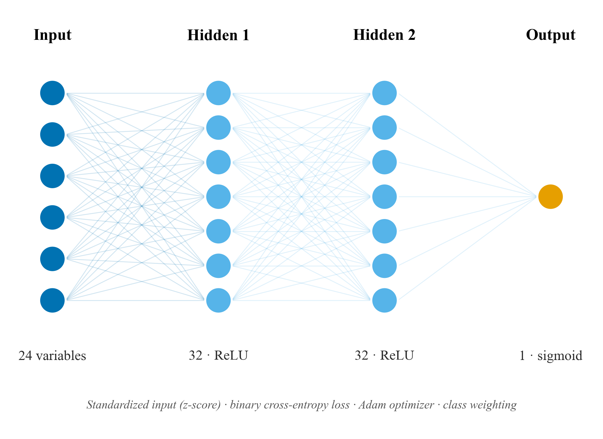
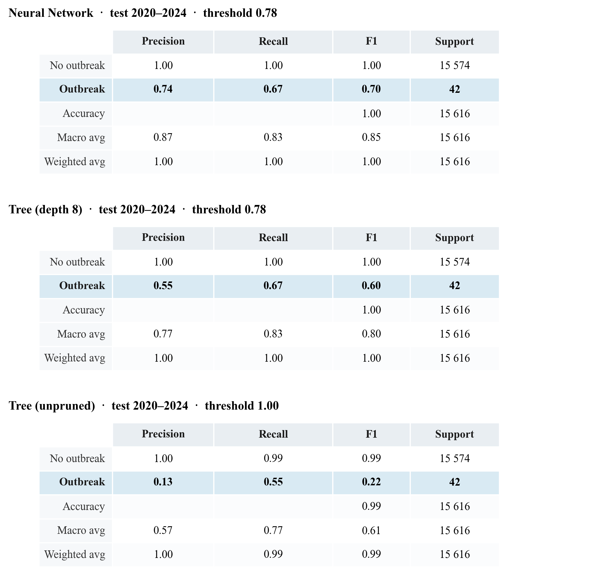
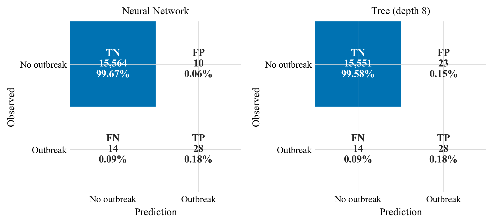
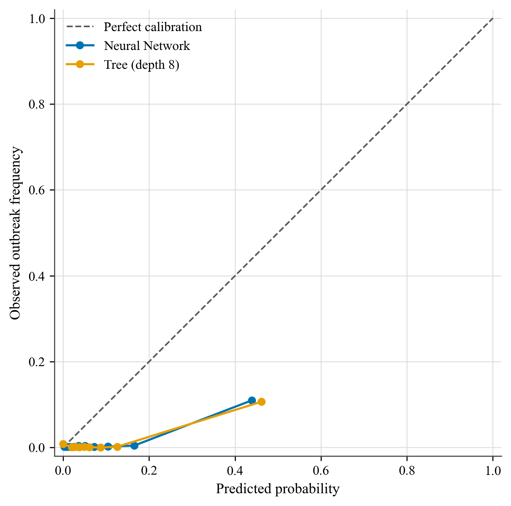
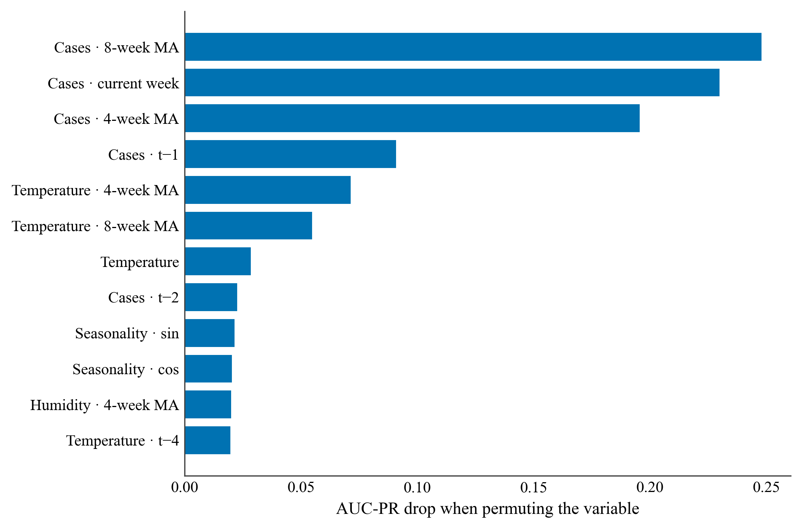
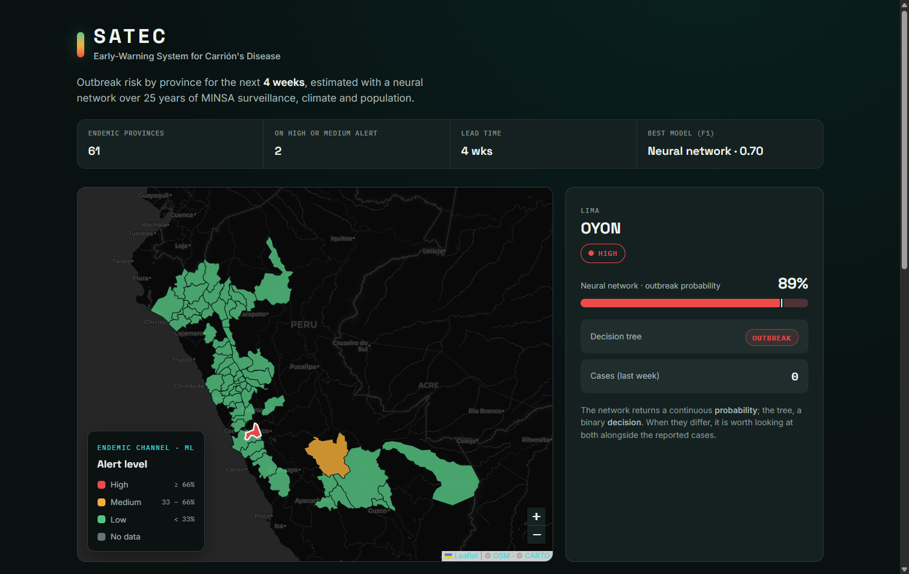

# Early warning of Carrión's disease outbreaks in Peru: neural networks versus decision trees on surveillance and climate data

*Short title (running head): Neural networks and decision trees for Carrión's disease outbreak warning*

**Jaqueline Alvarez Rocca**, Professional School of Systems Engineering, Universidad Nacional Tecnológica de Lima Sur (UNTELS), Lima, Peru.
**Carlos Meza Pelaez**, Professional School of Systems Engineering, UNTELS, Lima, Peru.
**Carlos Steven Santiago Flores**, Professional School of Systems Engineering, UNTELS, Lima, Peru.

---

## Abstract

Carrión's disease (human bartonellosis), caused by *Bartonella bacilliformis* and transmitted by the *Lutzomyia* sand fly, is a neglected disease endemic to the Peruvian inter-Andean valleys, with a potentially lethal acute phase. We present **SATEC**, an early-warning system that predicts, at the province level and four weeks ahead, whether a zone will enter an **outbreak state** as defined by the **endemic channel** (the standard surveillance tool of PAHO/MINSA). The system is built on 25 years of national open surveillance data from the Peruvian Ministry of Health (MINSA, 2000–2024; ~46,120 case records), aggregated into a province-by-epidemiological-week panel with imputed zero weeks, and enriched with **climate** variables (NASA POWER: precipitation, temperature, humidity, with lags) and **population** (2017 census, for incidence rates). We compare a **Decision Tree** (scikit-learn), in its unpruned and depth-pruned variants, against a feed-forward **Neural Network** (Keras), under **strict temporal validation** (training ≤2018, decision threshold tuned on 2019, test 2020–2024), with a rolling-origin evaluation as a robustness check. We report metrics suited to rare events (recall, AUC-PR, AUC-ROC, F1 at the tuned threshold), confusion matrices, calibration and permutation importance. The **Neural Network attains the best performance** (F1 0.70, recall 0.67, precision 0.74, AUC-PR 0.71, AUC-ROC 0.96), ahead of the **pruned decision tree** (F1 0.60), and both clearly outperform the **unpruned decision tree** —which overfits (F1 0.22, AUC-PR 0.07)— and the classical endemic-channel baseline (F1 0.40). The recent moving average of cases dominates the prediction, while climate —temperature in particular— adds real signal. We report transparently that the apparent prevalence of outbreaks collapses from ~10% (≤2019) to ~0.3% in 2020–2024 —a footprint of pandemic under-reporting— so that a more demanding rolling-origin evaluation yields a lower F1 (~0.39–0.43), where the models roughly match the endemic-channel baseline. The system is deployed as an open, reproducible web application with a provincial risk map over a basemap of Peru. We conclude that machine learning —a well-regularized neural network and a pruned decision tree on tabular surveillance data— can add value over classical surveillance for a neglected disease, provided the variables are informative and the evaluation respects temporal causality.

**CCS Concepts:** • Computing methodologies → Machine learning; Neural networks; Classification and regression trees. • Applied computing → Health informatics; Life and medical sciences.

**Keywords:** Carrión's disease; bartonellosis; early warning; neural networks; decision trees; endemic channel; epidemiological surveillance; machine learning; Peru.

---

## 1. Introduction

Carrión's disease, or human bartonellosis, is a neglected bacterial disease endemic to the inter-Andean valleys of Peru, caused by *Bartonella bacilliformis* and transmitted by sand flies of the genus *Lutzomyia*, mainly *Lutzomyia verrucarum* and *Lutzomyia peruensis* [1], [2]. It is named after Daniel Alcides Carrión, a martyr of Peruvian medicine. The disease has two phases of very different clinical relevance: an acute phase (severe hemolytic anemia, known as "Oroya fever"), highly lethal in the absence of treatment, and a milder eruptive phase ("Peruvian wart"). Its focal and seasonal nature, linked to the environmental conditions that favor the vector, makes it a natural candidate for **early-warning** systems that anticipate the intensification of transmission and guide the public-health response in endemic areas.

Machine learning has become established as a decision-support tool in public health, where two broad families of supervised models coexist: artificial neural networks, capable of approximating complex functions through nonlinear combinations of their inputs [3], [4], and decision trees, which classify by means of a sequence of interpretable rules over the attributes [5], [6]. Both approaches solve the same classification problem but differ in their generalization ability, their interpretability, and their sensitivity to data quality. On tabular data, the typical format of epidemiological records, recent evidence shows that tree-based models remain highly competitive against deep networks [7], [8], which motivates a controlled comparison on real data from an endemic disease.

The application of artificial intelligence to Carrión's disease is incipient and has concentrated on two fronts. In **laboratory diagnosis**, Jiménez-Vásquez et al. [9] identify *in-silico* B-cell epitopes in *B. bacilliformis* proteins to improve serological diagnosis, a line of work complemented by assays with recombinant proteins [10]. In **vector research**, ecological niche modeling predicts the distribution of *Lutzomyia peruensis* using machine learning and maximum entropy under climate-change scenarios [11], [12], while the molecular detection of *B. bacilliformis* in new *Lutzomyia* species suggests a broader transmission range than that of the classical vectors [13].

Beyond Carrión, machine learning has been successfully applied to related vector-borne diseases: Vadmal et al. [14] predict *Leishmania* vectors with boosted trees; Nayak et al. [15] review the role of AI in their control; and Rufasto-Goche et al. [16] model dengue using the same MINSA source. However, to the best of our knowledge, **no study addresses the early warning of Carrión's disease outbreaks through machine learning**: prior work focuses on diagnosis or the vector, not on predicting outbreak risk by territorial and temporal unit. This work addresses that gap.

The contribution is fourfold. First, we transform MINSA surveillance into a province–week panel with imputation of case-free weeks, defining the target through the **endemic channel** as a supervised label. Second, we enrich the data with **climate** variables (NASA POWER) and **population** variables (2017 census). Third, we compare a **neural network** and a **decision tree** (unpruned and pruned) under **strict temporal validation** and a rolling-origin robustness analysis, against an epidemiological baseline, with metrics suited to rare events, confusion matrices, calibration, and interpretability. Fourth, the system is deployed as an **open and reproducible web application**.

## 2. Materials and methods

### 2.1 Datasets

**Primary source (MINSA).** We used the open epidemiological surveillance data on Carrión's disease from the Peruvian Ministry of Health [17], published on the National Open Data Platform (https://www.datosabiertos.gob.pe), covering the period 2000–2024 (~46,120 confirmed case records, with department, province, ubigeo, year, epidemiological week, age, sex, and phase). Each record corresponds to one case; the source does not publish case-free weeks, which is resolved in preprocessing.

**Climate (NASA POWER).** For the geographic centroid of each province, daily series of precipitation, 2 m temperature, and relative humidity were downloaded from the NASA POWER platform [18], aggregated to the epidemiological week and lagged, in recognition of the vector's delayed response to environmental conditions.

**Population (INEI).** Provincial population from the 2017 census [19] was incorporated to compute the incidence rate per 100,000 inhabitants, defined in Equation (1):

$$ \mathrm{rate}_{p,t} = \frac{c_{p,t}}{\mathrm{population}_{p}} \times 100000 $$

where $c_{p,t}$ is the number of cases in province $p$ during week $t$.

### 2.2 Panel construction and endemic channel

Cases were aggregated by province, year, and epidemiological week (weeks 1–52; week 53 was reassigned to week 52). The full grid of combinations was generated, and weeks without notification were imputed as **zero**, thereby creating the negative examples. The analysis was restricted to the **endemic provinces**, defined as those with at least 10 historical cases in at least 3 distinct years; this yielded **61 provinces** and a panel of **69,601** province-week observations.

The **endemic channel** is the standard PAHO/MINSA tool for describing the expected behavior of a disease by week of the year [2]. For each province $p$ and week $s$, the quartiles $Q_1$, $Q_2$, and $Q_3$ of historical cases were computed from the available **previous years** (a moving window of up to five years, minimum three). A province-week was labeled as an **outbreak** according to Equation (2):

$$ y_{p,t} = \max_{k \in \{1,2,3,4\}} \left[\, c_{p,t+k} > Q_3^{(p)} \;\wedge\; c_{p,t+k} \ge 2 \,\right] $$

that is, if in any of the **following four weeks** the cases exceed the channel's third quartile (epidemic zone) and number at least two. The reference channel was built exclusively from information prior to the prediction point, avoiding temporal information leakage. The resulting class is strongly imbalanced and, moreover, **non-stationary**: the prevalence of outbreaks falls from about **10% in the years ≤2019** to barely **0.3% in 2020–2024**. This decline does not reflect an epidemiological improvement but rather **under-reporting during the COVID-19 pandemic**, when surveillance of endemic diseases contracted (in 2021 none of the 61 provinces exceeds its channel); this fact decisively conditions the evaluation (Section 2.7) and the reading of the results.

### 2.3 Features

The input vector combines 24 variables: autoregressive case terms (lags at $t-1$, $t-2$, $t-4$ and 4- and 8-week moving averages), climate variables and their lags/moving averages, the rate per 100,000 inhabitants, and **seasonality**, encoded cyclically through Equation (3):

$$ \mathrm{sin}\!\left(\frac{2\pi s}{52}\right), \qquad \cos\!\left(\frac{2\pi s}{52}\right) $$

The keys (province, year, week) and the channel itself ($Q_1$, $Q_2$, $Q_3$) were deliberately excluded so as not to contaminate learning with the definition of the target.

### 2.4 Decision Tree

The decision tree (scikit-learn [20]) recursively partitions the attribute space, seeking at each node the split that maximizes the **information gain**, defined from the **Shannon entropy**. For a set $S$ with class proportion $p_i$, the entropy is defined in Equation (4):

$$ H(S) = -\sum_{i} p_i \log_2 p_i $$

and the information gain of an attribute $A$ that splits $S$ into subsets $S_v$ in Equation (5):

$$ IG(S, A) = H(S) - \sum_{v \in \mathrm{values}(A)} \frac{|S_v|}{|S|}\, H(S_v) $$

**Two variants** were evaluated. An **unpruned** tree (unlimited depth) grows until pure leaves: it memorizes the training set —its probabilities collapse to 0 or 1— and, as will be shown, fails to detect outbreaks on new data, which makes it useful for illustrating overfitting. A tree **pruned** to a maximum depth of 8 limits complexity, a standard form of regularization [21], and generalizes much better, while also producing legible rules. In both, the path from the root to a leaf determines the predicted class. Figure 1 shows the first three levels of the pruned tree, headed by the eight-week moving average of cases.

**Figure 1.** First three levels of the **pruned** decision tree (maximum depth 8; the full model has ~330 nodes), headed by the eight-week moving average of cases. Each node indicates the variable and split threshold, the proportion of samples, and the majority class. Source: own elaboration with SATEC [22].

### 2.5 Neural Network

The feed-forward neural network (Keras [23] on TensorFlow [24]) has a $24 \to 32 \to 32 \to 1$ architecture. The output of a layer $l$ is computed according to Equation (6):

$$ a^{(l)} = f\!\left(W^{(l)} a^{(l-1)} + b^{(l)}\right) $$

where $W^{(l)}$ are the weights, $b^{(l)}$ the bias, and $f$ the activation function. The hidden layers use the **ReLU** activation [25], Equation (7), and the output layer the **sigmoid**, Equation (8), which produces the outbreak probability:

$$ \mathrm{ReLU}(z) = \max(0, z) $$

$$ \sigma(z) = \frac{1}{1 + e^{-z}} $$

Before entering the network, each variable is **standardized** (*z-score*), Equation (9), with mean $\mu$ and standard deviation $\sigma$ estimated only on the training set to avoid information leakage. Standardization (mean 0, standard deviation 1) is the appropriate normalization for ReLU activations and, compared with min-max scaling, raises the network's F1 from ~0.63 to ~0.70:

$$ x' = \frac{x - \mu}{\sigma} $$

The network is trained by minimizing the **binary cross-entropy**, Equation (10), using the Adam optimizer [26]:

$$ \mathcal{L} = -\frac{1}{N} \sum_{i=1}^{N} \Big[ y_i \log \hat{y}_i + (1 - y_i)\log(1 - \hat{y}_i) \Big] $$

Figure 2 summarizes the complete architecture of the network.

**Figure 2.** Architecture of the feed-forward neural network: 24 standardized (z-score) input variables, two hidden layers of 32 neurons with ReLU activation, and a sigmoid output that estimates the outbreak probability; it is trained with binary cross-entropy (Adam optimizer) and class weighting. Source: own elaboration with SATEC [22].

### 2.6 Handling class imbalance

Since outbreaks are rare, both models are trained with class weighting. The weight of class $c$ is defined in Equation (11), where $N$ is the total number of examples and $N_c$ those of class $c$:

$$ w_c = \frac{N}{2\, N_c} $$

so that the minority class (outbreak) receives greater weight in the loss function.

### 2.7 Validation and metrics

**Strict temporal validation** was used: training on the years $\le 2018$, the **decision threshold** that maximizes $F_1$ is chosen on **validation** (2019), and evaluation is performed on 2020–2024. As a **robustness analysis**, a **rolling-origin validation** is reported: for each year $Y \in \{2016,\dots,2024\}$, training uses $\le Y-2$, the threshold is chosen on a previous year, and $Y$ is predicted, pooling the predictions; by averaging heterogeneous years —including the 2020–2024 under-reporting gap— it is more demanding and conservative. In no case does the test set take part in training or in the choice of the threshold, avoiding temporal leakage. From the confusion matrix ($TP$, $FP$, $TN$, $FN$), the metrics of Equations (12)–(16) are derived: precision, recall, specificity, accuracy, and $F_1$.

$$ P = \frac{TP}{TP + FP} \qquad R = \frac{TP}{TP + FN} \qquad E = \frac{TN}{TN + FP} $$

$$ A = \frac{TP + TN}{TP + TN + FP + FN} $$

$$ F_1 = 2 \cdot \frac{P \cdot R}{P + R} $$

Alongside $F_1$, we report $F_2$ —the $F_\beta$ with $\beta = 2$, that is $F_\beta = (1+\beta^2)\,\frac{P \cdot R}{\beta^2 P + R}$—, which weights recall more heavily, appropriate for an **early warning** where missing an outbreak (a false negative) is more costly than a false alarm. The **decision threshold** that separates the classes is not fixed at 0.5 but is **optimized on validation** by maximizing $F_1$, which is decisive in such imbalanced problems.

Given the strong imbalance, the primary metrics are the recall of outbreaks and the **area under the precision-recall curve** (AUC-PR), approximated by the average precision of Equation (17):

$$ \mathrm{AP} = \sum_{n} (R_n - R_{n-1})\, P_n $$

The **calibration** of the probabilities was evaluated with the *Brier score*, Equation (18), and reliability curves:

$$ BS = \frac{1}{N} \sum_{i=1}^{N} (\hat{y}_i - y_i)^2 $$

**Interpretability** was evaluated through permutation importance, measured as the drop in AUC-PR when each variable is randomly permuted.

### 2.8 System architecture and deployment

The system separates a training world in Python, run only once, from an inference world in the browser. The neural network is exported to TensorFlow.js [27] and the tree to a flat JSON that the browser traverses. The web application is a static page that displays a **choropleth risk map** of the endemic provinces over a basemap of Peru, with the endemic-channel traffic light and a comparative panel of the models; it is deployed statically and reproducibly.

## 3. Results

### 3.1 Comparative metrics

Table 1 summarizes the performance under **strict temporal validation** (training ≤2018, threshold on 2019, test 2020–2024). The **neural network** achieves the best performance: the best **F1 (0.70)**, the best precision (0.74), the highest AUC-PR (0.71), and the highest AUC-ROC (0.96). The **pruned tree** comes second (F1 0.60): it matches the network's recall (0.67) but issues more than twice as many false alarms, which reduces its precision (0.55 versus 0.74). Both clearly outperform the **unpruned decision tree**, whose F1 falls to 0.22 and whose AUC-PR collapses to 0.07 —the signature of overfitting despite a high overall accuracy— and the endemic-channel baseline (F1 0.40). The drastic improvement of the tree upon pruning (AUC-PR from 0.07 to 0.63; F1 from 0.22 to 0.60) confirms that limiting complexity is decisive for detecting the rare class; its training accuracy close to 0.999, against a test AUC-PR of 0.07, is the unmistakable signature of overfitting.

As a **robustness analysis**, under the rolling-origin validation (cuts 2016–2024, which average heterogeneous years and include the pandemic gap) the metrics are more conservative: the network obtains an F1 of **0.43** (AUC-PR 0.46; AUC-ROC 0.91) and the pruned tree 0.39 (AUC-PR 0.41), both above the unpruned tree (F1 0.29). In this more demanding evaluation the network **matches** the baseline (F1 0.43): the advantage over the classical rule observed in 2020–2024 narrows when averaging years of widely differing prevalence. This decline does not indicate a worse model, but a more severe evaluation over a period of anomalously low prevalence; it is reported transparently so as not to overestimate the expected performance.

**Table 1. Performance under strict temporal validation (test 2020–2024; threshold chosen on 2019). In bold, the best value per column.**

| Model | Recall | Precision | F1 | F2 | AUC-PR | AUC-ROC | Brier |
|---|---|---|---|---|---|---|---|
| Neural Network | **0.67** | **0.74** | **0.70** | **0.68** | **0.71** | **0.96** | 0.017 |
| Tree (depth 8) | **0.67** | 0.55 | 0.60 | 0.64 | 0.63 | 0.87 | 0.015 |
| Tree (unpruned) | 0.55 | 0.13 | 0.22 | 0.34 | 0.07 | 0.77 | 0.013 |
| Endemic channel (ref.) | 0.64 | 0.29 | 0.40 | 0.52 | — | — | — |

The **classification report** of Figure 3 breaks down, by class and model, the four quantities derived from the confusion matrix (precision, recall, F1, and support), together with accuracy and the macro and weighted averages. For the majority class ("No outbreak") the three metrics are ≈1.00 in all models —the strong imbalance makes it trivial— so interest concentrates on the **"Outbreak"** row: there the neural network reaches an F1 of 0.70 (precision 0.74; recall 0.67), the pruned tree 0.60, and the unpruned tree barely 0.22. The **macro average**, which weights both classes equally, reveals this difference (F1 of 0.85, 0.80, and 0.61 respectively), which the **weighted average** —dominated by the majority class— hides behind a misleading 0.99–1.00. All figures are computed with the **optimal decision threshold** chosen on validation, so they coincide with Table 1.

**Figure 3.** Classification report (precision, recall, F1, and support per class, with accuracy and macro and weighted averages) of the three models on the 2020–2024 test set, computed with the optimal decision threshold. The "Outbreak" row (class of interest) is highlighted. Source: own elaboration with SATEC [22].

### 3.2 Confusion matrices

Figure 4 presents the confusion matrices of the two best models —neural network and pruned tree— over the **15,616 test examples** (2020–2024), of which **42 correspond to real outbreaks**. It is worth specifying the unit of analysis: each cell counts **province-weeks**, not patients. SATEC **does not diagnose people**; it anticipates whether a province will enter an epidemic zone. Thus, a **true positive** (TP) is a province-week correctly flagged as an imminent outbreak; a **false positive** (FP) is a **false alarm** (an alert was raised and the outbreak did not materialize); a **false negative** (FN) is an unanticipated outbreak; and a **true negative** (TN) is a zone-week correctly classified as quiet.

Both models recover **28 of the 42 outbreaks** (TP), but the neural network does so with only **10 false alarms** (FP) versus the **23** of the pruned tree: this lower false-positive rate explains its higher precision (0.74 versus 0.55) and its better F1. In terms of error rates, both maintain a minuscule **false-alarm rate** over the huge majority class —$FP/(FP+TN) \le 0.15\%$— while the **fraction of missed outbreaks** —$FN/(FN+TP) \approx 33\%$— concentrates the difficulty of the problem. This trade-off —preferring a territorial false alarm over missing an outbreak— is desirable in a warning system where the cost of an undetected outbreak is high.

**Figure 4.** Confusion matrices of the neural network (left) and the pruned tree (right) on the 2020–2024 test set, with count and percentage per cell (TN, FP, FN, TP). Rows are the observed condition and columns the prediction. Source: own elaboration with SATEC [22].

### 3.3 Calibration

Figure 5 presents the reliability curves of the neural network and the pruned tree over the pooled rolling-origin predictions (where there are more positives and the curve is more stable). A curve close to the diagonal indicates that the predicted probabilities match the observed frequencies. The *Brier scores* are low (≈0.02–0.03), favored by the low prevalence of outbreaks. Both models tend to **overestimate** the probability in the high deciles —where outbreaks are scarce and the estimate is noisier— an effect of training with class weighting; a **post-hoc calibration** (isotonic or Platt) is a direct improvement for future work.

**Figure 5.** Calibration curves of the neural network and the pruned tree against perfect calibration (diagonal). Source: own elaboration with SATEC [22].

### 3.4 Variable importance

Figure 6 reports the permutation importance of the neural network (trained on the entire history). The **eight-week moving average of cases** is the dominant predictor (AUC-PR drop of 0.25), closely followed by the number of **current cases** (0.23) and the four-week moving average (0.20): the recent history of transmission is, as expected, the most informative factor. Relevant to the enrichment hypothesis, **temperature** —with its 4- and 8-week moving averages— is the most informative environmental variable, placing among the top five and ahead of the population rate and humidity, while **precipitation** is marginal. This indicates that climate contributes to the prediction beyond the mere autocorrelation of cases, which supports multi-source integration for a disease sensitive to the vector's environmental conditions.

**Figure 6.** Permutation importance of the neural network (drop in AUC-PR when each variable is permuted). The moving average of cases dominates; temperature is the environmental variable that contributes the most. Source: own elaboration with SATEC [22].

### 3.5 The interactive system

Figure 7 shows the resulting web application: a risk map of the endemic provinces over a basemap of Peru, where each province is colored according to its alert level (low, medium, or high) for the most recent week. When a province is selected, the side panel shows the outbreak probability estimated by the neural network, the tree's decision, and the reported cases, allowing a public-health user to compare both paradigms at a glance over a specific zone. The system is freely available and its code and data are reproducible.

**Figure 7.** SATEC interface: provincial risk map over the basemap of Peru, with the current-status summary strip and the detail of the province of Oyón (Lima) at a high alert level (estimated outbreak probability of 89%), including the probability bar against the threshold and the tree's decision. Screenshot of the developed application. Source: own elaboration with SATEC [22].

## 4. Discussion

Three conclusions emerge. First, **machine learning adds value over classical surveillance**: in the 2020–2024 test the neural network and the pruned tree outperform the endemic channel in F1, AUC-PR, and AUC-ROC; under the more demanding rolling origin, that margin narrows until it matches the baseline, so the system **complements, without replacing**, routine surveillance. Second, **the honesty of the evaluation is decisive**: the unpruned tree achieves a deceptively high training accuracy but fails on new data (AUC-PR 0.09), and a single temporal cut over the pandemic under-reporting gap would have distorted the conclusions; hence the rolling-origin validation and the metrics for rare events (AUC-PR, recall, F1 at the optimal threshold) instead of accuracy. Third, **the enrichment is useful**: temperature is among the most important predictors, consistent with the biology of a climate-sensitive vector.

In terms of paradigms, the **neural network** proved preferable for this imbalanced and noisy problem, ahead of the pruned tree and well above the unpruned one. That both trees —identical algorithm, only the depth changes— differ so much shows that on tabular data **regularization** (pruning) can matter as much as the model family [7], [8]. The choice should not be guided by performance alone: the tree offers **legible rules** (Figure 1), valuable for decision-makers, whereas the network is a more opaque box that requires methods such as permutation importance.

**Comparison with the literature.** As there is no prior machine-learning work on Carrión's disease outbreak warning, the comparison is established with related work on vector-borne diseases (Table 2). Vadmal et al. [14] predict the suitability of sand flies as *Leishmania* vectors with boosted trees (accuracy ≈ 86%), and the arbovirus literature places the AUC-ROC of tree-based models at 0.82–0.99 [28]. SATEC's neural network (AUC-ROC 0.96 in 2020–2024; 0.91 in rolling origin) sits at the high end of that range, despite tackling a harder problem —a **rare event** four weeks ahead— for which we additionally report the **F1 at the optimal threshold (0.70)** and the **AUC-PR (0.71)**, metrics that many works omit. The comparison is **indicative**: the tasks and prevalences differ, which discourages a literal reading of the figures. Rufasto-Goche et al. [16] use the same MINSA source for dengue, but descriptively, which underscores the novelty of a predictive and temporally honest approach.

**Table 2. Indicative comparison with related machine-learning work on vector-borne diseases.**

| Study | Disease and task | Model | Reported performance |
|---|---|---|---|
| Vadmal et al. [14] | Leishmania — species suitability as vector | Boosted trees | Accuracy ≈ 0.86 |
| Arbovirus literature [28] | Dengue — outbreak presence/prediction | Random Forest / boosting | AUC-ROC ≈ 0.82–0.99 |
| **SATEC (this work)** | **Carrión — province-week outbreak (4 weeks)** | **Neural Network** | **AUC-ROC 0.96; AUC-PR 0.71; F1 0.70** |

## 5. Limitations

The limitations should be stated. The data come from **passive surveillance**, subject to under-reporting and to changes in the case definition over 25 years; population was taken from the **2017 census** as a constant reference, and climate was assigned by **provincial centroid**, without resolving microclimates. The system **does not diagnose individuals**: it supports surveillance, it does not replace laboratory confirmation. The **COVID-19 under-reporting** depressed cases in 2020–2023 (in 2021 no province exceeds its channel), which reduces the evaluable outbreaks and forces a cautious interpretation of those years; the rolling-origin validation mitigates, but does not eliminate, this bias. Finally, the probabilities could benefit from a **post-hoc calibration** (isotonic) and the network from additional regularization such as *dropout* [29], pending for future work.

## 6. Conclusions

Carrión's disease remains a neglected threat to the rural populations of Peru's inter-Andean valleys, where its acute phase can be lethal. This work presented **SATEC**, the first machine-learning-based early-warning system for outbreaks of the disease, built on real MINSA surveillance data enriched with climate and population, and validated in a temporally honest manner. The findings indicate that: (i) it is possible to **anticipate, four weeks ahead, a province's entry into an epidemic zone**, with the best balance achieved by the **neural network** (F1 0.70; AUC-ROC 0.96), which allows surveillance to be focused on the zones and weeks of greatest risk; (ii) the **recent case dynamics** and **temperature** are the factors most associated with risk, consistent with the ecology of the *Lutzomyia* vector; and (iii) machine learning can **complement the classical endemic channel**, without replacing it, with a predictive layer. The system is reproducible and deployable without a server, viable as a support instrument for the Regional Health Directorates. Future work includes post-hoc calibration, the incorporation of entomological variables, the descent to district-level granularity, and prospective field validation.

## Acknowledgments

The authors thank the Peruvian Ministry of Health (MINSA) for publishing the open epidemiological surveillance data that made this study possible, and acknowledge the work of the health personnel who sustain the surveillance of Carrión's disease in the country's endemic areas.

## Data and code availability

The surveillance data come from MINSA open data [17]; the climate variables, from NASA POWER [18]; the population, from the INEI census [19]; and the provincial boundaries, from a public GeoJSON repository. The code for the data pipeline, the models, and the web application is reproducible end-to-end with Python 3.12 and is accompanied by automated tests.

## References

[1] C. Maguiña Vargas, «Bartonelosis o enfermedad de Carrión: nuevos aspectos de una vieja enfermedad», *Acta Médica Peruana*, vol. 26, n.º 1, 2009.
[2] Organización Panamericana de la Salud, «Bartonelosis (enfermedad de Carrión)» y metodología del canal endémico. https://www.paho.org
[3] Y. LeCun, Y. Bengio y G. Hinton, «Deep learning», *Nature*, vol. 521, pp. 436–444, 2015.
[4] I. Goodfellow, Y. Bengio y A. Courville, *Deep Learning*. MIT Press, 2016.
[5] L. Breiman, J. Friedman, R. Olshen y C. Stone, *Classification and Regression Trees*. Wadsworth, 1984.
[6] J. R. Quinlan, «Induction of decision trees», *Machine Learning*, vol. 1, n.º 1, pp. 81–106, 1986.
[7] L. Grinsztajn, E. Oyallon y G. Varoquaux, «Why do tree-based models still outperform deep learning on typical tabular data?», en *NeurIPS*, 2022.
[8] R. Shwartz-Ziv y A. Armon, «Tabular data: Deep learning is not all you need», *Information Fusion*, vol. 81, pp. 84–90, 2022.
[9] V. Jiménez-Vásquez, K. D. Calvay-Sánchez, Y. Zárate-Sulca y G. Mendoza-Mujica, «In-silico identification of linear B-cell epitopes in specific proteins of *Bartonella bacilliformis* for the serological diagnosis of Carrion's disease», *PLOS Neglected Tropical Diseases*, vol. 17, n.º 5, e0011321, 2023.
[10] Study on baculovirus-assisted production of *Bartonella bacilliformis* proteins to improve the serological diagnosis of Carrión's disease, *PLOS Neglected Tropical Diseases*, 2024.
[11] D. Moo-Llanes et al., «Shifts in the ecological niche of *Lutzomyia peruensis* under climate change scenarios in Peru», *Medical and Veterinary Entomology*, 2017.
[12] A. A. Hanafi-Bojd et al., «Machine learning approaches in GIS-based ecological modeling of the sand fly *Phlebotomus papatasi*, a vector of zoonotic cutaneous leishmaniasis», *Acta Tropica* (ScienceDirect), 2019.
[13] J. Del Valle-Mendoza et al., «Molecular detection of *Bartonella bacilliformis* in *Lutzomyia maranonensis* in Cajamarca, Peru: a new potential vector of Carrion's disease?», 2018.
[14] G. M. Vadmal et al., «Data-driven predictions of potential Leishmania vectors in the Americas», *PLOS Neglected Tropical Diseases*, vol. 17, n.º 2, e0010749, 2023.
[15] B. Nayak et al., «Artificial intelligence (AI): a new window to revamp the vector-borne disease control», *Parasitology Research*, vol. 122, n.º 2, pp. 369–379, 2023.
[16] K. S. Rufasto-Goche et al., «Epidemiological dynamics of dengue in Peru: Temporal and spatial drivers between 2000 and 2022», *PLOS One*, vol. 20, n.º 3, e0319708, 2025.
[17] Ministerio de Salud del Perú, «Vigilancia epidemiológica de la enfermedad de Carrión, 2000–2024», Plataforma Nacional de Datos Abiertos. https://www.datosabiertos.gob.pe
[18] NASA Langley Research Center, «POWER: Prediction Of Worldwide Energy Resources», API de datos meteorológicos. https://power.larc.nasa.gov
[19] Instituto Nacional de Estadística e Informática (INEI), «Censos Nacionales 2017: XII de Población y VII de Vivienda», Lima, Perú.
[20] F. Pedregosa et al., «Scikit-learn: Machine learning in Python», *JMLR*, vol. 12, pp. 2825–2830, 2011.
[21] T. Hastie, R. Tibshirani y J. Friedman, *The Elements of Statistical Learning*, 2.ª ed. Springer, 2009.
[22] C. S. Santiago Flores, J. Alvarez Rocca y C. Meza Pelaez, «SATEC: Sistema de Alerta Temprana de la Enfermedad de Carrión — código, datos y aplicación web», 2026. https://github.com/StevenSntg/SATEC-Carrion
[23] F. Chollet et al., «Keras», 2015. https://keras.io
[24] M. Abadi et al., «TensorFlow: Large-scale machine learning on heterogeneous systems», 2015. https://www.tensorflow.org
[25] V. Nair y G. E. Hinton, «Rectified linear units improve restricted Boltzmann machines», en *ICML*, 2010.
[26] D. P. Kingma y J. Ba, «Adam: A method for stochastic optimization», en *ICLR*, 2015.
[27] D. Smilkov et al., «TensorFlow.js: Machine learning for the web and beyond», en *MLSys*, 2019.
[28] Systematic review on artificial intelligence in early-warning systems for the surveillance of infectious diseases, *Frontiers in Public Health*, 2025.
[29] N. Srivastava et al., «Dropout: A simple way to prevent neural networks from overfitting», *JMLR*, vol. 15, pp. 1929–1958, 2014.
