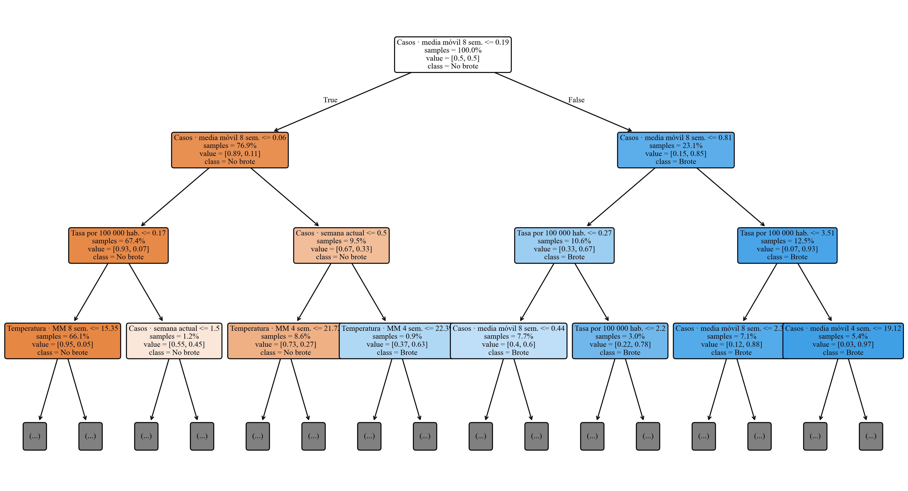
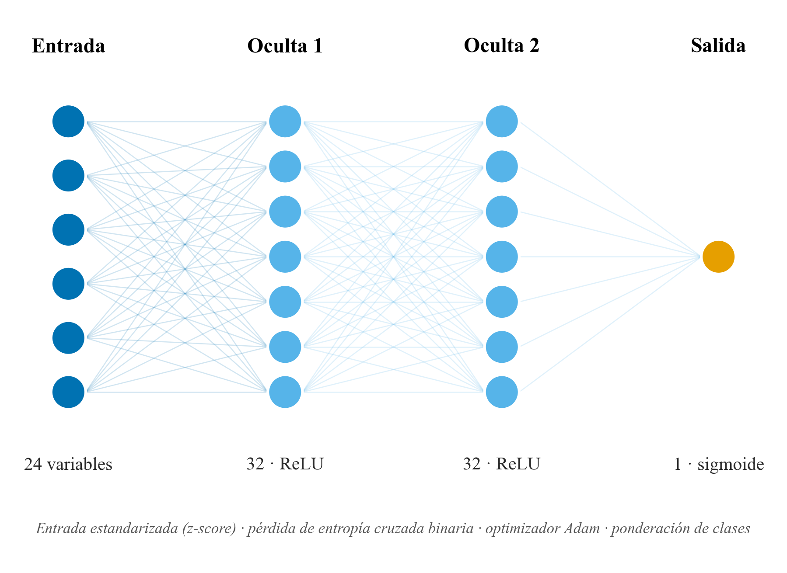
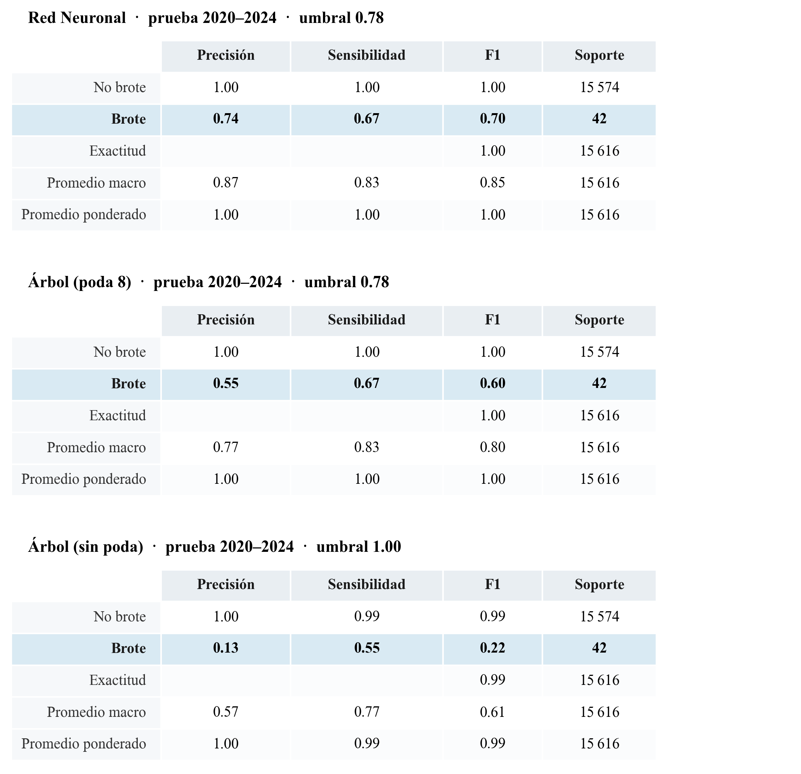

# Alerta temprana de brotes de la enfermedad de Carrión en el Perú: redes neuronales frente a árboles de decisión sobre datos de vigilancia y clima

*Título corto (encabezado): Redes neuronales y árboles de decisión para la alerta de brotes de Carrión*

**Jaqueline Alvarez Rocca**, Escuela Profesional de Ingeniería de Sistemas, Universidad Nacional Tecnológica de Lima Sur (UNTELS), Lima, Perú.
**Carlos Meza Pelaez**, Escuela Profesional de Ingeniería de Sistemas, UNTELS, Lima, Perú.
**Carlos Steven Santiago Flores**, Escuela Profesional de Ingeniería de Sistemas, UNTELS, Lima, Perú.

---

## Abstract

Carrión's disease (human bartonellosis), caused by *Bartonella bacilliformis* and transmitted by the *Lutzomyia* sand fly, is a neglected disease endemic to the Peruvian inter-Andean valleys, with a potentially lethal acute phase. We present **SATEC**, an early-warning system that predicts, at the province level and four weeks ahead, whether a zone will enter an **outbreak state** as defined by the **endemic channel** (the standard surveillance tool of PAHO/MINSA). The system is built on 25 years of national open surveillance data from the Peruvian Ministry of Health (MINSA, 2000–2024; ~46,120 case records), aggregated into a province-by-epidemiological-week panel with imputed zero weeks, and enriched with **climate** variables (NASA POWER: precipitation, temperature, humidity, with lags) and **population** (2017 census, for incidence rates). We compare a **Decision Tree** (scikit-learn), in its unpruned and depth-pruned variants, against a feed-forward **Neural Network** (Keras), under **strict temporal validation** (training ≤2018, decision threshold tuned on 2019, test 2020–2024), with a rolling-origin evaluation as a robustness check. We report metrics suited to rare events (recall, AUC-PR, AUC-ROC, F1 at the tuned threshold), confusion matrices, calibration and permutation importance. The **Neural Network attains the best performance** (F1 0.70, recall 0.67, precision 0.74, AUC-PR 0.71, AUC-ROC 0.96), ahead of the **pruned decision tree** (F1 0.60), and both clearly outperform the **unpruned decision tree** —which overfits (F1 0.22, AUC-PR 0.07)— and the classical endemic-channel baseline (F1 0.40). The recent moving average of cases dominates the prediction, while climate —temperature in particular— adds real signal. We report transparently that the apparent prevalence of outbreaks collapses from ~10% (≤2019) to ~0.3% in 2020–2024 —a footprint of pandemic under-reporting— so that a more demanding rolling-origin evaluation yields a lower F1 (~0.39–0.43), where the models roughly match the endemic-channel baseline. The system is deployed as an open, reproducible web application with a provincial risk map over a basemap of Peru. We conclude that machine learning —a well-regularized neural network and a pruned decision tree on tabular surveillance data— can add value over classical surveillance for a neglected disease, provided the variables are informative and the evaluation respects temporal causality.

**CCS Concepts:** • Computing methodologies → Machine learning; Neural networks; Classification and regression trees. • Applied computing → Health informatics; Life and medical sciences.

**Keywords:** Carrión's disease; bartonellosis; early warning; neural networks; decision trees; endemic channel; epidemiological surveillance; machine learning; Peru.

## Resumen

La enfermedad de Carrión (bartonelosis humana), causada por *Bartonella bacilliformis* y transmitida por el vector *Lutzomyia*, es una enfermedad desatendida y endémica de los valles interandinos del Perú, con una fase aguda potencialmente letal. Presentamos **SATEC**, un sistema de alerta temprana que predice, a nivel de **provincia** y con **cuatro semanas de anticipación**, si una zona entrará en **estado de brote** según el **canal endémico** (la herramienta estándar de vigilancia de la OPS/MINSA). El sistema se construye sobre 25 años de datos abiertos de vigilancia del Ministerio de Salud (MINSA, 2000–2024; ~46.120 registros de casos), agregados en un panel provincia por semana epidemiológica con imputación de semanas en cero, y enriquecidos con variables **climáticas** (NASA POWER: precipitación, temperatura, humedad, con rezagos) y de **población** (censo 2017, para tasas de incidencia). Se comparan un **Árbol de Decisión** (scikit-learn), en sus variantes sin poda y podado, frente a una **Red Neuronal** prealimentada (Keras), bajo **validación temporal estricta** (entrenamiento ≤2018, umbral ajustado en 2019, prueba 2020–2024), con una evaluación de origen móvil como análisis de robustez. Se reportan métricas adecuadas a eventos raros (sensibilidad, AUC-PR, AUC-ROC, F1 en el umbral óptimo), matrices de confusión, calibración e importancia por permutación. La **Red Neuronal logra el mejor desempeño** (F1 0,70; sensibilidad 0,67; precisión 0,74; AUC-PR 0,71; AUC-ROC 0,96), por delante del árbol de decisión **podado** (F1 0,60), y ambos superan con claridad al **árbol sin poda** —que sobreajusta (F1 0,22; AUC-PR 0,07)— y al baseline clásico del canal endémico (F1 0,40). La media móvil reciente de casos domina la predicción, mientras que el clima —en particular la temperatura— aporta señal real. Reportamos con transparencia que la prevalencia aparente de brotes se desploma del ~10 % (≤2019) al ~0,3 % en 2020–2024 —huella de la subnotificación pandémica—, por lo que una evaluación más exigente de origen móvil arroja un F1 menor (~0,39–0,43), donde los modelos igualan aproximadamente al baseline del canal endémico. El sistema se despliega como una aplicación web abierta y reproducible con un mapa de riesgo provincial sobre un mapa base del Perú. Concluimos que el aprendizaje automático —una red neuronal bien regularizada y un árbol de decisión podado sobre datos tabulares de vigilancia— puede aportar valor sobre la vigilancia clásica en una enfermedad desatendida, siempre que las variables sean informativas y la evaluación respete la causalidad temporal.

**Palabras clave:** enfermedad de Carrión; bartonelosis; alerta temprana; redes neuronales; árboles de decisión; canal endémico; vigilancia epidemiológica; aprendizaje automático; Perú.

---

## 1. Introducción

La enfermedad de Carrión, o bartonelosis humana, es una enfermedad bacteriana desatendida y endémica de los valles interandinos del Perú, causada por *Bartonella bacilliformis* y transmitida por flebótomos del género *Lutzomyia*, principalmente *Lutzomyia verrucarum* y *Lutzomyia peruensis* [1], [2]. Lleva el nombre de Daniel Alcides Carrión, mártir de la medicina peruana. La enfermedad presenta dos fases de relevancia clínica muy distinta: una fase aguda (anemia hemolítica severa, conocida como «Fiebre de la Oroya»), de alta letalidad en ausencia de tratamiento, y una fase eruptiva («Verruga Peruana»), más benigna. Su carácter focal y estacional, ligado a las condiciones ambientales que favorecen al vector, la convierte en una candidata natural para sistemas de **alerta temprana** que anticipen la intensificación de la transmisión y orienten la respuesta de salud pública en las zonas endémicas.

El aprendizaje automático se ha consolidado como una herramienta de apoyo a la decisión en salud pública, donde conviven dos grandes familias de modelos supervisados: las redes neuronales artificiales, capaces de aproximar funciones complejas mediante combinaciones no lineales de sus entradas [3], [4], y los árboles de decisión, que clasifican mediante una secuencia de reglas interpretables sobre los atributos [5], [6]. Ambos enfoques resuelven el mismo problema de clasificación, pero difieren en su capacidad de generalización, su interpretabilidad y su sensibilidad a la calidad de los datos. En datos tabulares, el formato típico de los registros epidemiológicos, la evidencia reciente muestra que los modelos basados en árboles siguen siendo altamente competitivos frente a las redes profundas [7], [8], lo que motiva una comparación controlada sobre datos reales de una enfermedad endémica.

La aplicación de la inteligencia artificial a la enfermedad de Carrión es incipiente y se ha concentrado en dos frentes. En el **diagnóstico de laboratorio**, Jiménez-Vásquez et al. [9] identifican *in-silico* epítopos de células B en proteínas de *B. bacilliformis* para mejorar el diagnóstico serológico, línea a la que se suman ensayos con proteínas recombinantes [10]. En el **estudio del vector**, el modelado de nicho ecológico predice la distribución de *Lutzomyia peruensis* con aprendizaje automático y máxima entropía bajo escenarios de cambio climático [11], [12], mientras que la detección molecular de *B. bacilliformis* en nuevas especies de *Lutzomyia* sugiere un rango de transmisión más amplio que el de los vectores clásicos [13].

Más allá de Carrión, el aprendizaje automático se aplica con éxito a enfermedades vectoriales emparentadas: Vadmal et al. [14] predicen vectores de *Leishmania* con árboles potenciados; Nayak et al. [15] revisan el papel de la IA en su control; y Rufasto-Goche et al. [16] modelan el dengue con la misma fuente del MINSA. Sin embargo, hasta donde conocemos, **ningún estudio aborda la alerta temprana de brotes de Carrión mediante aprendizaje automático**: los antecedentes se centran en el diagnóstico o el vector, no en la predicción del riesgo de brote por unidad territorial y temporal. Este trabajo atiende ese vacío.

La contribución es cuádruple. Primero, se transforma la vigilancia del MINSA en un panel provincia–semana con imputación de las semanas sin casos, definiendo el objetivo mediante el **canal endémico** como etiqueta supervisada. Segundo, se enriquecen los datos con variables **climáticas** (NASA POWER) y de **población** (censo 2017). Tercero, se comparan una **red neuronal** y un **árbol de decisión** (sin poda y podado) bajo **validación temporal estricta** y un análisis de robustez de origen móvil, frente a un baseline epidemiológico, con métricas adecuadas a eventos raros, matrices de confusión, calibración e interpretabilidad. Cuarto, el sistema se despliega como una **aplicación web abierta y reproducible**.

## 2. Materiales y métodos

### 2.1 Conjuntos de datos

**Fuente primaria (MINSA).** Se emplearon los datos abiertos de vigilancia epidemiológica de la enfermedad de Carrión del Ministerio de Salud del Perú [17], publicados en la Plataforma Nacional de Datos Abiertos (https://www.datosabiertos.gob.pe), correspondientes al periodo 2000–2024 (~46.120 registros de casos confirmados, con departamento, provincia, ubigeo, año, semana epidemiológica, edad, sexo y fase). Cada registro corresponde a un caso; la fuente no publica las semanas sin casos, lo que se resuelve en el preprocesamiento.

**Clima (NASA POWER).** Para el centroide geográfico de cada provincia se descargaron series diarias de precipitación, temperatura a 2 m y humedad relativa de la plataforma NASA POWER [18], agregadas a semana epidemiológica y rezagadas, en reconocimiento de la respuesta diferida del vector a las condiciones ambientales.

**Población (INEI).** Se incorporó la población provincial del censo 2017 [19] para calcular la tasa de incidencia por 100.000 habitantes, definida en la Ecuación (1):

$$ \mathrm{tasa}_{p,t} = \frac{c_{p,t}}{\mathrm{poblacion}_{p}} \times 100000 $$

donde $c_{p,t}$ es el número de casos en la provincia $p$ durante la semana $t$.

### 2.2 Construcción del panel y canal endémico

Los casos se agregaron por provincia, año y semana epidemiológica (semanas 1–52; la semana 53 se reasignó a la 52). Se generó la rejilla completa de combinaciones y se imputaron en **cero** las semanas sin notificación, creando así los ejemplos negativos. El análisis se restringió a las **provincias endémicas**, definidas como aquellas con al menos 10 casos históricos en al menos 3 años distintos; se obtuvieron **61 provincias** y un panel de **69.601** observaciones provincia-semana.

El **canal endémico** es la herramienta estándar de la OPS/MINSA para describir el comportamiento esperado de una enfermedad por semana del año [2]. Para cada provincia $p$ y semana $s$ se calcularon, a partir de los **años previos** disponibles (ventana móvil de hasta cinco años, mínimo tres), los cuartiles $Q_1$, $Q_2$ y $Q_3$ de los casos históricos. Una provincia-semana se etiquetó como **brote** según la Ecuación (2):

$$ y_{p,t} = \max_{k \in \{1,2,3,4\}} \left[\, c_{p,t+k} > Q_3^{(p)} \;\wedge\; c_{p,t+k} \ge 2 \,\right] $$

es decir, si en alguna de las **cuatro semanas siguientes** los casos superan el tercer cuartil del canal (zona de epidemia) y son al menos dos. El canal de referencia se construyó exclusivamente con información anterior al punto de predicción, evitando la fuga de información temporal. La clase resultante está fuertemente desbalanceada y, además, **no estacionaria**: la prevalencia de brotes pasa de cerca del **10 % en los años ≤2019** a apenas **0,3 % en 2020–2024**. Esta caída no refleja una mejora epidemiológica sino la **subnotificación durante la pandemia de COVID-19**, cuando la vigilancia de enfermedades endémicas se contrajo (en 2021 ninguna de las 61 provincias supera su canal); este hecho condiciona de manera decisiva la evaluación (Sección 2.7) y la lectura de los resultados.

### 2.3 Características

El vector de entrada combina 24 variables: términos autorregresivos de casos (rezagos en $t-1$, $t-2$, $t-4$ y medias móviles de 4 y 8 semanas), variables climáticas y sus rezagos/medias móviles, la tasa por 100.000 habitantes, y la **estacionalidad**, codificada de forma cíclica mediante la Ecuación (3):

$$ \mathrm{sen}\!\left(\frac{2\pi s}{52}\right), \qquad \cos\!\left(\frac{2\pi s}{52}\right) $$

Se excluyeron deliberadamente las claves (provincia, año, semana) y el propio canal ($Q_1$, $Q_2$, $Q_3$) para no contaminar el aprendizaje con la definición del objetivo.

### 2.4 Árbol de Decisión

El árbol de decisión (scikit-learn [20]) divide recursivamente el espacio de atributos buscando, en cada nodo, la partición que maximiza la **ganancia de información**, definida a partir de la **entropía de Shannon**. Para un conjunto $S$ con proporción de clase $p_i$, la entropía se define en la Ecuación (4):

$$ H(S) = -\sum_{i} p_i \log_2 p_i $$

y la ganancia de información de un atributo $A$ que parte $S$ en subconjuntos $S_v$ en la Ecuación (5):

$$ IG(S, A) = H(S) - \sum_{v \in \mathrm{valores}(A)} \frac{|S_v|}{|S|}\, H(S_v) $$

Se evaluaron **dos variantes**. Un árbol **sin poda** (profundidad ilimitada) crece hasta hojas puras: memoriza el entrenamiento —sus probabilidades colapsan a 0 o 1— y, como se verá, fracasa al detectar brotes en datos nuevos, por lo que sirve para ilustrar el sobreajuste. Un árbol **podado** a profundidad máxima 8 limita la complejidad, una forma estándar de regularización [21], y generaliza mucho mejor, además de producir reglas legibles. En ambos, el recorrido desde la raíz hasta una hoja determina la clase predicha. La Figura 1 muestra los tres primeros niveles del árbol podado, encabezados por la media móvil de casos a ocho semanas.

**Figura 1.** Tres primeros niveles del árbol de decisión **podado** (profundidad máxima 8; el modelo completo tiene ~330 nodos), encabezados por la media móvil de casos a ocho semanas. Cada nodo indica la variable y el umbral de partición, la proporción de muestras y la clase mayoritaria. Fuente: elaboración propia con SATEC [22].

### 2.5 Red Neuronal

La red neuronal prealimentada (Keras [23] sobre TensorFlow [24]) tiene una arquitectura $24 \to 32 \to 32 \to 1$. La salida de una capa $l$ se calcula según la Ecuación (6):

$$ a^{(l)} = f\!\left(W^{(l)} a^{(l-1)} + b^{(l)}\right) $$

donde $W^{(l)}$ son los pesos, $b^{(l)}$ el sesgo y $f$ la función de activación. Las capas ocultas usan la activación **ReLU** [25], Ecuación (7), y la capa de salida la **sigmoide**, Ecuación (8), que produce la probabilidad de brote:

$$ \mathrm{ReLU}(z) = \max(0, z) $$

$$ \sigma(z) = \frac{1}{1 + e^{-z}} $$

Antes de entrar a la red, cada variable se **estandariza** (*z-score*), Ecuación (9), con media $\mu$ y desviación $\sigma$ estimadas solo en el conjunto de entrenamiento para evitar fuga de información. La estandarización (media 0, desviación 1) es la normalización adecuada para las activaciones ReLU y, frente al escalado min-max, eleva el F1 de la red de ~0,63 a ~0,70:

$$ x' = \frac{x - \mu}{\sigma} $$

La red se entrena minimizando la **entropía cruzada binaria**, Ecuación (10), mediante el optimizador Adam [26]:

$$ \mathcal{L} = -\frac{1}{N} \sum_{i=1}^{N} \Big[ y_i \log \hat{y}_i + (1 - y_i)\log(1 - \hat{y}_i) \Big] $$

La Figura 2 resume la arquitectura completa de la red.

**Figura 2.** Arquitectura de la red neuronal prealimentada: 24 variables de entrada estandarizadas (z-score), dos capas ocultas de 32 neuronas con activación ReLU y una salida sigmoide que estima la probabilidad de brote; se entrena con entropía cruzada binaria (optimizador Adam) y ponderación de clases. Fuente: elaboración propia con SATEC [22].

### 2.6 Manejo del desbalance

Dado que los brotes son raros, ambos modelos se entrenan con ponderación de clases. El peso de la clase $c$ se define en la Ecuación (11), donde $N$ es el total de ejemplos y $N_c$ los de la clase $c$:

$$ w_c = \frac{N}{2\, N_c} $$

de modo que la clase minoritaria (brote) recibe mayor peso en la función de pérdida.

### 2.7 Validación y métricas

Se empleó **validación temporal estricta**: se entrena con los años $\le 2018$, el **umbral de decisión** que maximiza $F_1$ se elige en **validación** (2019) y se evalúa sobre 2020–2024. Como **análisis de robustez** se reporta una **validación de origen móvil** (*rolling-origin*): para cada año $Y \in \{2016,\dots,2024\}$ se entrena con $\le Y-2$, se elige el umbral en un año previo y se predice $Y$, agrupando las predicciones; al promediar años heterogéneos —incluido el hueco de subnotificación de 2020–2024— es más exigente y conservadora. En ningún caso el conjunto de prueba interviene en el entrenamiento ni en la elección del umbral, evitando la fuga temporal. A partir de la matriz de confusión ($VP$, $FP$, $VN$, $FN$) se derivan las métricas de las Ecuaciones (12)–(16): precisión, sensibilidad, especificidad, exactitud y $F_1$.

$$ P = \frac{VP}{VP + FP} \qquad R = \frac{VP}{VP + FN} \qquad E = \frac{VN}{VN + FP} $$

$$ A = \frac{VP + VN}{VP + VN + FP + FN} $$

$$ F_1 = 2 \cdot \frac{P \cdot R}{P + R} $$

Junto a $F_1$ se reporta $F_2$ —la $F_\beta$ con $\beta = 2$, esto es $F_\beta = (1+\beta^2)\,\frac{P \cdot R}{\beta^2 P + R}$—, que pondera más la sensibilidad, lo apropiado para una **alerta temprana** donde omitir un brote (un falso negativo) es más costoso que una falsa alarma. El **umbral de decisión** que separa las clases no se fija en 0,5 sino que se **optimiza en validación** maximizando $F_1$, lo que es decisivo en problemas tan desbalanceados.

Dado el fuerte desbalance, las métricas primarias son la sensibilidad de brotes y el **área bajo la curva de precisión-exhaustividad** (AUC-PR), aproximada por la precisión media de la Ecuación (17):

$$ \mathrm{AP} = \sum_{n} (R_n - R_{n-1})\, P_n $$

La **calibración** de las probabilidades se evaluó con el *Brier score*, Ecuación (18), y curvas de fiabilidad:

$$ BS = \frac{1}{N} \sum_{i=1}^{N} (\hat{y}_i - y_i)^2 $$

La **interpretabilidad** se evaluó mediante importancia por permutación, medida como la caída en AUC-PR al permutar aleatoriamente cada variable.

### 2.8 Arquitectura del sistema y despliegue

El sistema separa un mundo de entrenamiento en Python, que se ejecuta una sola vez, de un mundo de inferencia en el navegador. La red neuronal se exporta a TensorFlow.js [27] y el árbol a un JSON plano que el navegador recorre. La aplicación web es una página estática que muestra un **mapa de riesgo coroplético** de las provincias endémicas sobre un mapa base del Perú, con el semáforo del canal endémico y un panel comparativo de los modelos; se despliega de forma estática y reproducible.

## 3. Resultados

### 3.1 Métricas comparadas

La Tabla 1 resume el desempeño bajo **validación temporal estricta** (entrenamiento ≤2018, umbral en 2019, prueba 2020–2024). La **red neuronal** logra el mejor desempeño: el mejor **F1 (0,70)**, la mejor precisión (0,74), el mayor AUC-PR (0,71) y el mayor AUC-ROC (0,96). El **árbol podado** queda en segundo lugar (F1 0,60): iguala la sensibilidad de la red (0,67) pero emite más del doble de falsas alarmas, lo que reduce su precisión (0,55 frente a 0,74). Ambos superan ampliamente al **árbol de decisión sin poda**, cuyo F1 cae a 0,22 y cuyo AUC-PR se desploma a 0,07 —la firma del sobreajuste pese a una exactitud global alta—, y al baseline del canal endémico (F1 0,40). La drástica mejora del árbol al podarlo (AUC-PR de 0,07 a 0,63; F1 de 0,22 a 0,60) confirma que limitar la complejidad es decisivo para detectar la clase rara; su exactitud de entrenamiento cercana a 0,999, frente a un AUC-PR de prueba de 0,07, es la firma inequívoca del sobreajuste.

Como **análisis de robustez**, bajo la validación de origen móvil (cortes 2016–2024, que promedian años heterogéneos e incluyen el hueco pandémico) las métricas son más conservadoras: la red obtiene un F1 de **0,43** (AUC-PR 0,46; AUC-ROC 0,91) y el árbol podado 0,39 (AUC-PR 0,41), ambos por encima del árbol sin poda (F1 0,29). En esta evaluación más exigente la red **iguala** al baseline (F1 0,43): la ventaja sobre la regla clásica observada en 2020–2024 se estrecha al promediar años de prevalencia muy dispar. Esta caída no señala un peor modelo, sino una evaluación más severa sobre un período de prevalencia anómalamente baja; se reporta con transparencia para no sobrestimar el desempeño esperable.

**Tabla 1. Desempeño bajo validación temporal estricta (prueba 2020–2024; umbral elegido en 2019). En negrita, el mejor valor por columna.**

| Modelo | Sensibilidad | Precisión | F1 | F2 | AUC-PR | AUC-ROC | Brier |
|---|---|---|---|---|---|---|---|
| Red Neuronal | **0,67** | **0,74** | **0,70** | **0,68** | **0,71** | **0,96** | 0,017 |
| Árbol (poda 8) | **0,67** | 0,55 | 0,60 | 0,64 | 0,63 | 0,87 | 0,015 |
| Árbol (sin poda) | 0,55 | 0,13 | 0,22 | 0,34 | 0,07 | 0,77 | 0,013 |
| Canal endémico (ref.) | 0,64 | 0,29 | 0,40 | 0,52 | — | — | — |

El **reporte de clasificación** de la Figura 3 desglosa, por clase y modelo, las cuatro magnitudes derivadas de la matriz de confusión (precisión, sensibilidad, F1 y soporte), junto con la exactitud y los promedios macro y ponderado. Para la clase mayoritaria («No brote») las tres métricas son ≈1,00 en todos los modelos —el fuerte desbalance la hace trivial—, por lo que el interés se concentra en la fila **«Brote»**: ahí la red neuronal alcanza un F1 de 0,70 (precisión 0,74; sensibilidad 0,67), el árbol podado 0,60 y el árbol sin poda apenas 0,22. El **promedio macro**, que pondera ambas clases por igual, evidencia esa diferencia (F1 de 0,85, 0,80 y 0,61 respectivamente), que el **promedio ponderado** —dominado por la clase mayoritaria— oculta tras un engañoso 0,99–1,00. Todas las cifras se calculan con el **umbral de decisión óptimo** elegido en validación, por lo que coinciden con la Tabla 1.

**Figura 3.** Reporte de clasificación (precisión, sensibilidad, F1 y soporte por clase, con exactitud y promedios macro y ponderado) de los tres modelos sobre el conjunto de prueba 2020–2024, calculado con el umbral de decisión óptimo. La fila «Brote» (clase de interés) aparece resaltada. Fuente: elaboración propia con SATEC [22].

### 3.2 Matrices de confusión

La Figura 4 presenta las matrices de confusión de los dos mejores modelos —red neuronal y árbol podado— sobre los **15.616 ejemplos de prueba** (2020–2024), de los cuales **42 corresponden a brotes reales**. Conviene precisar la unidad de análisis: cada celda cuenta **provincias-semana**, no pacientes. SATEC **no diagnostica personas**; anticipa si una provincia entrará en zona de epidemia. Así, un **verdadero positivo** (VP) es una provincia-semana correctamente alertada como brote inminente; un **falso positivo** (FP) es una **falsa alarma** (se alertó y el brote no se materializó); un **falso negativo** (FN) es un brote no anticipado; y un **verdadero negativo** (VN) es una zona-semana correctamente clasificada como tranquila.

Ambos modelos recuperan **28 de los 42 brotes** (VP), pero la red neuronal lo hace con solo **10 falsas alarmas** (FP) frente a las **23** del árbol podado: esa menor tasa de falsos positivos explica su mayor precisión (0,74 frente a 0,55) y su mejor F1. En términos de tasas de error, ambos mantienen una **tasa de falsas alarmas** ínfima sobre la enorme clase mayoritaria —$FP/(FP+VN) \le 0{,}15\,\%$—, mientras que la **fracción de brotes omitidos** —$FN/(FN+VP) \approx 33\,\%$— concentra la dificultad del problema. Este compromiso —preferir una falsa alarma territorial antes que omitir un brote— es deseable en un sistema de alerta donde el costo de un brote no detectado es alto.

**Figura 4.** Matrices de confusión de la red neuronal (izquierda) y el árbol podado (derecha) sobre el conjunto de prueba 2020–2024, con conteo y porcentaje por celda (VN, FP, FN, VP). Las filas son la condición observada y las columnas la predicción. Fuente: elaboración propia con SATEC [22].

### 3.3 Calibración

La Figura 5 presenta las curvas de fiabilidad de la red neuronal y el árbol podado sobre las predicciones agrupadas del origen móvil (donde hay más positivos y la curva resulta más estable). Una curva próxima a la diagonal indica que las probabilidades predichas coinciden con las frecuencias observadas. Los *Brier scores* son bajos (≈0,02–0,03), favorecidos por la baja prevalencia de brotes. Ambos modelos tienden a **sobreestimar** la probabilidad en los deciles altos —donde los brotes son escasos y la estimación es más ruidosa—, efecto del entrenamiento con ponderación de clases; una **calibración posterior** (isotónica o de Platt) es una mejora directa para trabajo futuro.

**Figura 5.** Curvas de calibración de la red neuronal y el árbol podado frente a la calibración perfecta (diagonal). Fuente: elaboración propia con SATEC [22].

### 3.4 Importancia de variables

La Figura 6 reporta la importancia por permutación de la red neuronal (entrenada con todo el histórico). La **media móvil de ocho semanas de casos** es el predictor dominante (caída en AUC-PR de 0,25), seguida de cerca por el número de **casos actuales** (0,23) y la media móvil de cuatro semanas (0,20): la historia reciente de la transmisión es, como cabía esperar, el factor más informativo. De manera relevante para la hipótesis de enriquecimiento, la **temperatura** —con sus medias móviles de 4 y 8 semanas— es la variable ambiental más informativa, situándose entre las cinco primeras y por delante de la tasa poblacional y de la humedad, mientras que la **precipitación** resulta marginal. Esto indica que el clima contribuye a la predicción más allá de la mera autocorrelación de los casos, lo que respalda la integración multifuente para una enfermedad sensible a las condiciones ambientales del vector.

**Figura 6.** Importancia por permutación de la red neuronal (caída en AUC-PR al permutar cada variable). La media móvil de casos domina; la temperatura es la variable ambiental que más aporta. Fuente: elaboración propia con SATEC [22].

### 3.5 El sistema interactivo

La Figura 7 muestra la aplicación web resultante: un mapa de riesgo de las provincias endémicas sobre un mapa base del Perú, donde cada provincia se colorea según su nivel de alerta (bajo, medio o alto) para la semana más reciente. Al seleccionar una provincia, el panel lateral muestra la probabilidad de brote estimada por la red neuronal, la decisión del árbol y los casos notificados, lo que permite a un usuario de salud pública comparar de un vistazo ambos paradigmas sobre una zona concreta. El sistema es de uso libre y su código y datos son reproducibles.

**Figura 7.** Interfaz de SATEC: mapa de riesgo provincial sobre el mapa base del Perú, con la franja de resumen del estado actual y el detalle de la provincia de Oyón (Lima) en nivel de alerta alto (probabilidad de brote estimada del 89 %), incluida la barra de probabilidad frente al umbral y la decisión del árbol. Captura de la aplicación desarrollada. Fuente: elaboración propia con SATEC [22].

## 4. Discusión

Tres conclusiones emergen. Primero, **el aprendizaje automático aporta valor sobre la vigilancia clásica**: en la prueba 2020–2024 la red neuronal y el árbol podado superan al canal endémico en F1, AUC-PR y AUC-ROC; bajo origen móvil, más exigente, ese margen se estrecha hasta igualar al baseline, por lo que el sistema **complementa, sin reemplazar**, la vigilancia rutinaria. Segundo, **la honestidad de la evaluación es decisiva**: el árbol sin poda logra una exactitud engañosamente alta en entrenamiento pero fracasa en datos nuevos (AUC-PR 0,09), y un único corte temporal sobre el hueco de subnotificación pandémica habría distorsionado las conclusiones; de ahí la validación de origen móvil y las métricas para eventos raros (AUC-PR, sensibilidad, F1 en umbral óptimo) en lugar de la exactitud. Tercero, **el enriquecimiento es útil**: la temperatura figura entre los predictores más importantes, coherente con la biología de un vector sensible al clima.

En términos de paradigmas, la **red neuronal** resultó preferible para este problema desbalanceado y ruidoso, por delante del árbol podado y muy por encima del sin poda. Que ambos árboles —idéntico algoritmo, solo cambia la profundidad— difieran tanto evidencia que en datos tabulares la **regularización** (la poda) puede pesar tanto como la familia del modelo [7], [8]. La elección no debería guiarse solo por el desempeño: el árbol ofrece **reglas legibles** (Figura 1), valiosas para los tomadores de decisión, mientras que la red es una caja más opaca que requiere métodos como la importancia por permutación.

**Comparación con la literatura.** Al no existir antecedentes de aprendizaje automático para la alerta de brotes de Carrión, la comparación se establece con trabajos afines en enfermedades vectoriales (Tabla 2). Vadmal et al. [14] predicen la idoneidad de flebótomos como vectores de *Leishmania* con árboles potenciados (exactitud ≈ 86 %), y la literatura de arbovirosis sitúa el AUC-ROC de modelos basados en árboles en 0,82–0,99 [28]. La red neuronal de SATEC (AUC-ROC 0,96 en 2020–2024; 0,91 en origen móvil) se ubica en el extremo alto de ese rango, pese a abordar un problema más difícil —un **evento raro** a cuatro semanas—, para el que además reportamos el **F1 en umbral óptimo (0,70)** y el **AUC-PR (0,71)**, métricas que muchos trabajos omiten. La comparación es **orientativa**: las tareas y prevalencias difieren, lo que desaconseja una lectura literal de las cifras. Rufasto-Goche et al. [16] usan la misma fuente del MINSA para el dengue, pero de forma descriptiva, lo que subraya la novedad de un planteamiento predictivo y temporalmente honesto.

**Tabla 2. Comparación orientativa con trabajos afines de aprendizaje automático en enfermedades vectoriales.**

| Estudio | Enfermedad y tarea | Modelo | Desempeño reportado |
|---|---|---|---|
| Vadmal et al. [14] | Leishmania — idoneidad de especie como vector | Árboles potenciados | Exactitud ≈ 0,86 |
| Literatura de arbovirosis [28] | Dengue — presencia/predicción de brote | Random Forest / boosting | AUC-ROC ≈ 0,82–0,99 |
| **SATEC (este trabajo)** | **Carrión — brote provincia-semana (4 sem.)** | **Red Neuronal** | **AUC-ROC 0,96; AUC-PR 0,71; F1 0,70** |

## 5. Limitaciones

Conviene declarar las limitaciones. Los datos provienen de **vigilancia pasiva**, sujeta a subnotificación y a cambios en la definición de caso a lo largo de 25 años; la población se tomó del **censo 2017** como referencia constante, y el clima se asignó por **centroide provincial**, sin resolver microclimas. El sistema **no diagnostica individuos**: apoya la vigilancia, no sustituye la confirmación de laboratorio. La **subnotificación por COVID-19** deprimió los casos de 2020–2023 (en 2021 ninguna provincia supera su canal), lo que reduce los brotes evaluables y obliga a interpretar con cautela esos años; la validación de origen móvil mitiga, pero no elimina, este sesgo. Por último, las probabilidades podrían beneficiarse de una **calibración posterior** (isotónica) y la red de regularización adicional como el *dropout* [29], pendientes para trabajo futuro.

## 6. Conclusiones

La enfermedad de Carrión sigue siendo una amenaza desatendida para las poblaciones rurales de los valles interandinos del Perú, donde su fase aguda puede ser letal. Este trabajo presentó **SATEC**, el primer sistema de alerta temprana de brotes de la enfermedad basado en aprendizaje automático, construido sobre datos reales de vigilancia del MINSA enriquecidos con clima y población, y validado de forma temporalmente honesta. Los hallazgos indican que: (i) es posible **anticipar con cuatro semanas la entrada de una provincia en zona de epidemia**, con el mejor equilibrio logrado por la **red neuronal** (F1 0,70; AUC-ROC 0,96), lo que permite focalizar la vigilancia en las zonas y semanas de mayor riesgo; (ii) la **dinámica reciente de casos** y la **temperatura** son los factores más asociados al riesgo, en consonancia con la ecología del vector *Lutzomyia*; y (iii) el aprendizaje automático puede **complementar al canal endémico clásico**, sin reemplazarlo, con una capa predictiva. El sistema es reproducible y desplegable sin servidor, viable como instrumento de apoyo para las Direcciones Regionales de Salud. Como trabajo futuro se plantea la calibración posterior, la incorporación de variables entomológicas, el descenso a granularidad distrital y la validación prospectiva en campo.

## Agradecimientos

Los autores agradecen al Ministerio de Salud del Perú (MINSA) por la publicación de los datos abiertos de vigilancia epidemiológica que hicieron posible este estudio, y reconocen la labor del personal de salud que sostiene la vigilancia de la enfermedad de Carrión en las zonas endémicas del país.

## Disponibilidad de datos y código

Los datos de vigilancia provienen de los datos abiertos del MINSA [17]; las variables climáticas, de NASA POWER [18]; la población, del censo del INEI [19]; y los límites provinciales, de un repositorio GeoJSON público. El código del pipeline de datos, los modelos y la aplicación web son reproducibles de extremo a extremo con Python 3.12 y se acompañan de pruebas automatizadas.

## Referencias

[1] C. Maguiña Vargas, «Bartonelosis o enfermedad de Carrión: nuevos aspectos de una vieja enfermedad», *Acta Médica Peruana*, vol. 26, n.º 1, 2009.
[2] Organización Panamericana de la Salud, «Bartonelosis (enfermedad de Carrión)» y metodología del canal endémico. https://www.paho.org
[3] Y. LeCun, Y. Bengio y G. Hinton, «Deep learning», *Nature*, vol. 521, pp. 436–444, 2015.
[4] I. Goodfellow, Y. Bengio y A. Courville, *Deep Learning*. MIT Press, 2016.
[5] L. Breiman, J. Friedman, R. Olshen y C. Stone, *Classification and Regression Trees*. Wadsworth, 1984.
[6] J. R. Quinlan, «Induction of decision trees», *Machine Learning*, vol. 1, n.º 1, pp. 81–106, 1986.
[7] L. Grinsztajn, E. Oyallon y G. Varoquaux, «Why do tree-based models still outperform deep learning on typical tabular data?», en *NeurIPS*, 2022.
[8] R. Shwartz-Ziv y A. Armon, «Tabular data: Deep learning is not all you need», *Information Fusion*, vol. 81, pp. 84–90, 2022.
[9] V. Jiménez-Vásquez, K. D. Calvay-Sánchez, Y. Zárate-Sulca y G. Mendoza-Mujica, «In-silico identification of linear B-cell epitopes in specific proteins of *Bartonella bacilliformis* for the serological diagnosis of Carrion's disease», *PLOS Neglected Tropical Diseases*, vol. 17, n.º 5, e0011321, 2023.
[10] Estudio sobre producción de proteínas de *Bartonella bacilliformis* asistida por baculovirus para mejorar el diagnóstico serológico de la enfermedad de Carrión, *PLOS Neglected Tropical Diseases*, 2024.
[11] D. Moo-Llanes et al., «Shifts in the ecological niche of *Lutzomyia peruensis* under climate change scenarios in Peru», *Medical and Veterinary Entomology*, 2017.
[12] A. A. Hanafi-Bojd et al., «Machine learning approaches in GIS-based ecological modeling of the sand fly *Phlebotomus papatasi*, a vector of zoonotic cutaneous leishmaniasis», *Acta Tropica* (ScienceDirect), 2019.
[13] J. Del Valle-Mendoza et al., «Molecular detection of *Bartonella bacilliformis* in *Lutzomyia maranonensis* in Cajamarca, Peru: a new potential vector of Carrion's disease?», 2018.
[14] G. M. Vadmal et al., «Data-driven predictions of potential Leishmania vectors in the Americas», *PLOS Neglected Tropical Diseases*, vol. 17, n.º 2, e0010749, 2023.
[15] B. Nayak et al., «Artificial intelligence (AI): a new window to revamp the vector-borne disease control», *Parasitology Research*, vol. 122, n.º 2, pp. 369–379, 2023.
[16] K. S. Rufasto-Goche et al., «Epidemiological dynamics of dengue in Peru: Temporal and spatial drivers between 2000 and 2022», *PLOS One*, vol. 20, n.º 3, e0319708, 2025.
[17] Ministerio de Salud del Perú, «Vigilancia epidemiológica de la enfermedad de Carrión, 2000–2024», Plataforma Nacional de Datos Abiertos. https://www.datosabiertos.gob.pe
[18] NASA Langley Research Center, «POWER: Prediction Of Worldwide Energy Resources», API de datos meteorológicos. https://power.larc.nasa.gov
[19] Instituto Nacional de Estadística e Informática (INEI), «Censos Nacionales 2017: XII de Población y VII de Vivienda», Lima, Perú.
[20] F. Pedregosa et al., «Scikit-learn: Machine learning in Python», *JMLR*, vol. 12, pp. 2825–2830, 2011.
[21] T. Hastie, R. Tibshirani y J. Friedman, *The Elements of Statistical Learning*, 2.ª ed. Springer, 2009.
[22] C. S. Santiago Flores, J. Alvarez Rocca y C. Meza Pelaez, «SATEC: Sistema de Alerta Temprana de la Enfermedad de Carrión — código, datos y aplicación web», 2026. https://github.com/StevenSntg/SATEC-Carrion
[23] F. Chollet et al., «Keras», 2015. https://keras.io
[24] M. Abadi et al., «TensorFlow: Large-scale machine learning on heterogeneous systems», 2015. https://www.tensorflow.org
[25] V. Nair y G. E. Hinton, «Rectified linear units improve restricted Boltzmann machines», en *ICML*, 2010.
[26] D. P. Kingma y J. Ba, «Adam: A method for stochastic optimization», en *ICLR*, 2015.
[27] D. Smilkov et al., «TensorFlow.js: Machine learning for the web and beyond», en *MLSys*, 2019.
[28] Revisión sistemática sobre inteligencia artificial en sistemas de alerta temprana para la vigilancia de enfermedades infecciosas, *Frontiers in Public Health*, 2025.
[29] N. Srivastava et al., «Dropout: A simple way to prevent neural networks from overfitting», *JMLR*, vol. 15, pp. 1929–1958, 2014.
