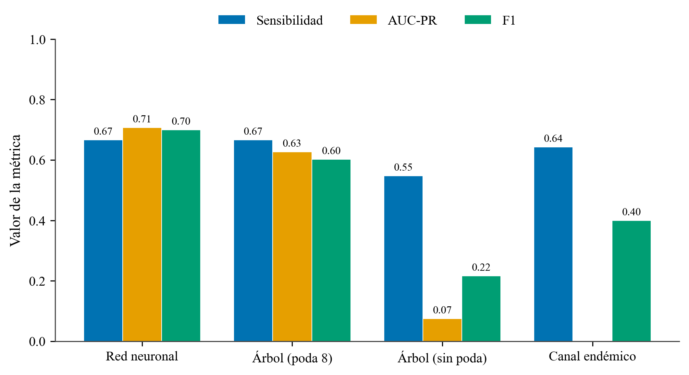
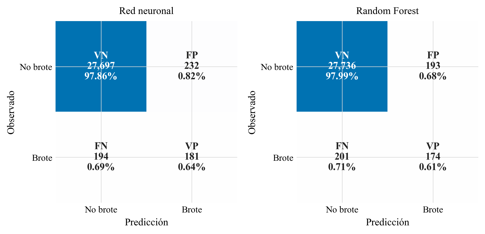
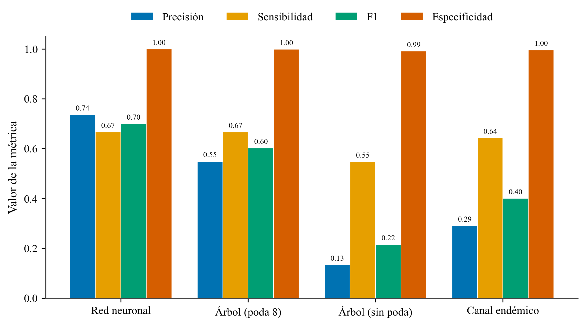
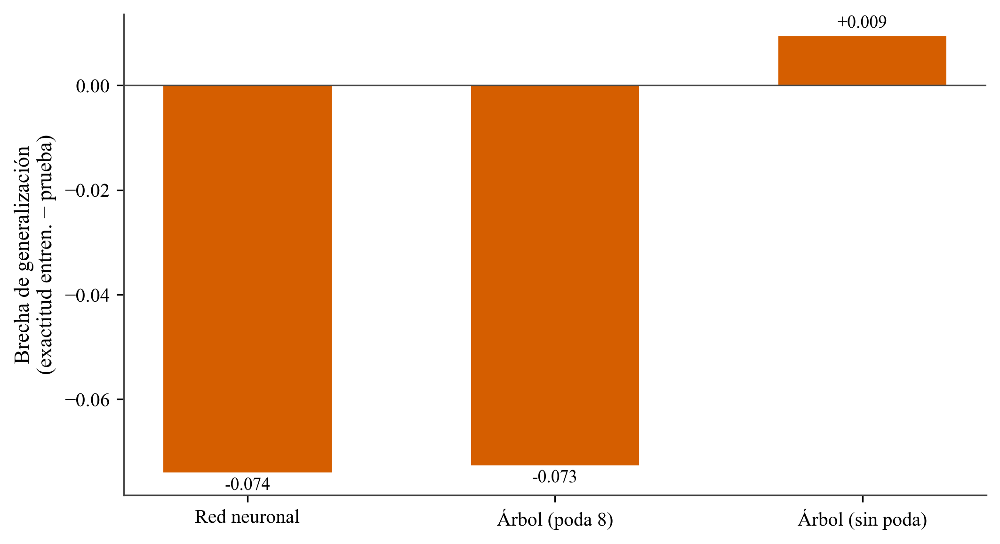
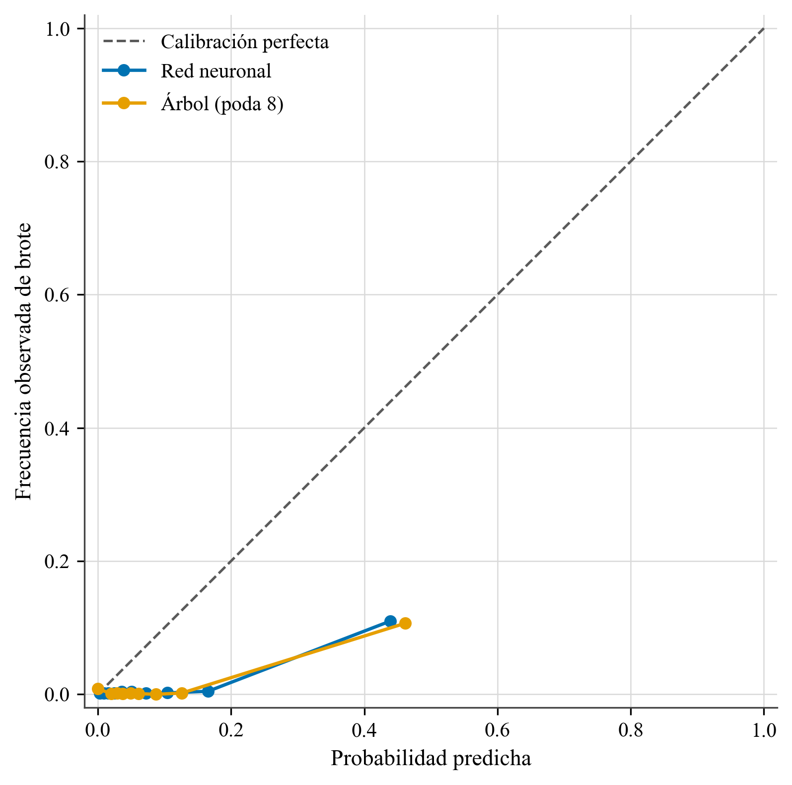
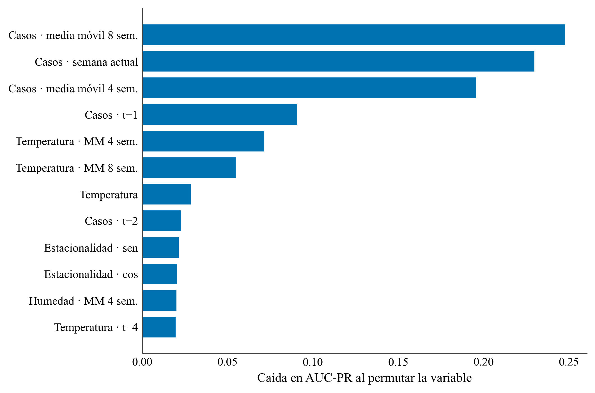
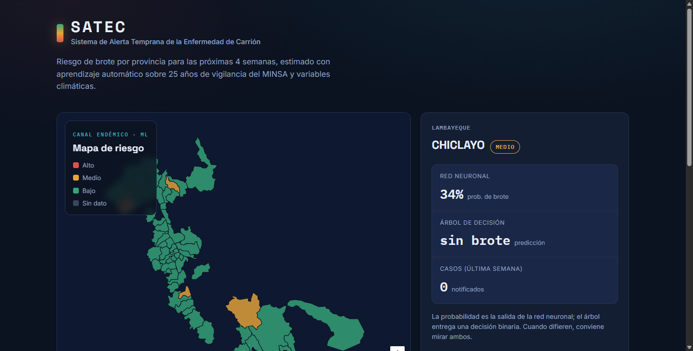

# Alerta temprana de brotes de la enfermedad de Carrión en el Perú: redes neuronales frente a árboles de decisión sobre datos de vigilancia y clima

*Título corto (encabezado): Redes neuronales y árboles de decisión para la alerta de brotes de Carrión*

**Jaqueline Alvarez Rocca**, Escuela Profesional de Ingeniería de Sistemas, Universidad Nacional Tecnológica de Lima Sur (UNTELS), Lima, Perú.
**Carlos Meza Pelaez**, Escuela Profesional de Ingeniería de Sistemas, UNTELS, Lima, Perú.
**Carlos Steven Santiago Flores**, Escuela Profesional de Ingeniería de Sistemas, UNTELS, Lima, Perú.

---

## Abstract

Carrión's disease (human bartonellosis), caused by *Bartonella bacilliformis* and transmitted by the *Lutzomyia* sand fly, is a neglected disease endemic to the Peruvian inter-Andean valleys, with a potentially lethal acute phase. We present **SATEC**, an early-warning system that predicts, at the province level and four weeks ahead, whether a zone will enter an **outbreak state** as defined by the **endemic channel** (the standard surveillance tool of PAHO/MINSA). The system is built on 25 years of national open surveillance data from the Peruvian Ministry of Health (MINSA, 2000–2024; ~46,120 case records), aggregated into a province-by-epidemiological-week panel with imputed zero weeks, and enriched with **climate** variables (NASA POWER: precipitation, temperature, humidity, with lags) and **population** (2017 census, for incidence rates). We compare **tree-based models** —a **Decision Tree**, a **Random Forest** and **Gradient Boosting** (scikit-learn)— against a feed-forward **Neural Network** (Keras), under **rolling-origin temporal validation** (yearly test folds, 2016–2024) with the decision threshold tuned on validation, complemented by a single pre-/post-pandemic split. We report metrics suited to rare events (recall, AUC-PR, AUC-ROC, F1 at the tuned threshold), confusion matrices, calibration and permutation importance. The **Random Forest attains the best overall performance** (F1 0.47, AUC-ROC 0.94, Brier 0.009), narrowly ahead of the neural network, and both clearly outperform the unpruned tree —which overfits— and the classical endemic-channel baseline; the recent moving average of cases dominates the prediction, while climate and population add real signal. We further show that the apparent prevalence of outbreaks collapses from ~10% (≤2019) to ~0.3% in 2020–2024, a footprint of pandemic under-reporting that makes any single recent split misleading and motivates rolling-origin evaluation. The system is deployed as an open, reproducible web application with a provincial risk map over a basemap of Peru. We conclude that machine learning —particularly tree ensembles on tabular surveillance data— can add value over classical surveillance for a neglected disease, provided the variables are informative and the evaluation respects temporal causality.

**CCS Concepts:** • Computing methodologies → Machine learning; Neural networks; Classification and regression trees. • Applied computing → Health informatics; Life and medical sciences.

**Keywords:** Carrión's disease; bartonellosis; early warning; neural networks; decision trees; random forest; gradient boosting; endemic channel; epidemiological surveillance; machine learning; Peru.

## Resumen

La enfermedad de Carrión (bartonelosis humana), causada por *Bartonella bacilliformis* y transmitida por el vector *Lutzomyia*, es una enfermedad desatendida y endémica de los valles interandinos del Perú, con una fase aguda potencialmente letal. Presentamos **SATEC**, un sistema de alerta temprana que predice, a nivel de **provincia** y con **cuatro semanas de anticipación**, si una zona entrará en **estado de brote** según el **canal endémico** (la herramienta estándar de vigilancia de la OPS/MINSA). El sistema se construye sobre 25 años de datos abiertos de vigilancia del Ministerio de Salud (MINSA, 2000–2024; ~46.120 registros de casos), agregados en un panel provincia por semana epidemiológica con imputación de semanas en cero, y enriquecidos con variables **climáticas** (NASA POWER: precipitación, temperatura, humedad, con rezagos) y de **población** (censo 2017, para tasas de incidencia). Se comparan **modelos basados en árboles** —un **Árbol de Decisión**, un **Random Forest** y **Gradient Boosting** (scikit-learn)— frente a una **Red Neuronal** prealimentada (Keras), bajo **validación temporal de origen móvil** (cortes anuales de prueba, 2016–2024) con el umbral de decisión ajustado en validación, complementada con una partición única pre/pospandemia. Se reportan métricas adecuadas a eventos raros (sensibilidad, AUC-PR, AUC-ROC, F1 en el umbral óptimo), matrices de confusión, calibración e importancia por permutación. El **Random Forest logra el mejor desempeño global** (F1 0,47; AUC-ROC 0,94; Brier 0,009), por delante de la red neuronal por un margen estrecho, y ambos superan con claridad al árbol sin poda —que sobreajusta— y al baseline clásico del canal endémico; la media móvil reciente de casos domina la predicción, mientras que el clima y la población aportan señal real. Mostramos además que la prevalencia aparente de brotes se desploma del ~10 % (≤2019) al ~0,3 % en 2020–2024, huella de la subnotificación pandémica que vuelve engañosa cualquier partición reciente única y motiva la evaluación de origen móvil. El sistema se despliega como una aplicación web abierta y reproducible con un mapa de riesgo provincial sobre un mapa base del Perú. Concluimos que el aprendizaje automático —en particular los ensambles de árboles sobre datos tabulares de vigilancia— puede aportar valor sobre la vigilancia clásica en una enfermedad desatendida, siempre que las variables sean informativas y la evaluación respete la causalidad temporal.

**Palabras clave:** enfermedad de Carrión; bartonelosis; alerta temprana; redes neuronales; árboles de decisión; Random Forest; Gradient Boosting; canal endémico; vigilancia epidemiológica; aprendizaje automático; Perú.

---

## 1. Introducción

La enfermedad de Carrión, o bartonelosis humana, es una enfermedad bacteriana desatendida y endémica de los valles interandinos del Perú, causada por *Bartonella bacilliformis* y transmitida por flebótomos del género *Lutzomyia*, principalmente *Lutzomyia verrucarum* y *Lutzomyia peruensis* [1], [2]. Lleva el nombre de Daniel Alcides Carrión, mártir de la medicina peruana. La enfermedad presenta dos fases de relevancia clínica muy distinta: una fase aguda (anemia hemolítica severa, conocida como «Fiebre de la Oroya»), de alta letalidad en ausencia de tratamiento, y una fase eruptiva («Verruga Peruana»), más benigna. Su carácter focal y estacional, ligado a las condiciones ambientales que favorecen al vector, la convierte en una candidata natural para sistemas de **alerta temprana** que anticipen la intensificación de la transmisión y orienten la respuesta de salud pública en las zonas endémicas.

El aprendizaje automático se ha consolidado como una herramienta de apoyo a la decisión en salud pública, donde conviven dos grandes familias de modelos supervisados: las redes neuronales artificiales, capaces de aproximar funciones complejas mediante combinaciones no lineales de sus entradas [3], [4], y los árboles de decisión, que clasifican mediante una secuencia de reglas interpretables sobre los atributos [5], [6]. Ambos enfoques resuelven el mismo problema de clasificación, pero difieren en su capacidad de generalización, su interpretabilidad y su sensibilidad a la calidad de los datos. En datos tabulares, el formato típico de los registros epidemiológicos, la evidencia reciente muestra que los modelos basados en árboles siguen siendo altamente competitivos frente a las redes profundas [7], [8], lo que motiva una comparación controlada sobre datos reales de una enfermedad endémica.

La aplicación de la inteligencia artificial a la enfermedad de Carrión es todavía incipiente y se ha concentrado en dos frentes: el diagnóstico de laboratorio y el estudio del vector. En el primero, Jiménez-Vásquez et al. [9] aplican un análisis *in-silico* que combina múltiples predictores computacionales para identificar epítopos lineales de células B en proteínas de *B. bacilliformis*, con el fin de mejorar el diagnóstico serológico de la enfermedad de Carrión; en la misma línea, trabajos recientes evalúan proteínas recombinantes producidas mediante sistemas de baculovirus para aumentar la sensibilidad y especificidad de los ensayos serológicos [10]. En el segundo frente, el modelado de nicho ecológico ha permitido predecir la distribución espacial de los vectores: estudios sobre *Lutzomyia peruensis* emplean algoritmos de aprendizaje automático y de máxima entropía (máquinas de vectores de soporte, MaxEnt y algoritmos genéticos de predicción de reglas) para anticipar desplazamientos de su nicho bajo escenarios de cambio climático en el Perú [11], y enfoques análogos basados en aprendizaje automático y sistemas de información geográfica se han usado para modelar la distribución de flebótomos vectores en otras regiones [12]. De forma complementaria, la detección molecular de *B. bacilliformis* en nuevas especies de *Lutzomyia* sugiere que el rango de transmisión es más amplio de lo que indican los vectores clásicos [13].

Más allá de la enfermedad de Carrión, el aprendizaje automático se aplica con éxito a enfermedades vectoriales emparentadas y al uso de datos abiertos peruanos. Vadmal et al. [14] entrenan modelos de árboles potenciados para predecir vectores potenciales de *Leishmania* en América, identificando focos en Madre de Dios; Nayak et al. [15] revisan el papel de la inteligencia artificial en el control de las enfermedades transmitidas por vectores; y Rufasto-Goche et al. [16] modelan la dinámica espacio-temporal del dengue con veintidós años de vigilancia del MINSA, la misma fuente que se emplea en este trabajo. Sin embargo, hasta donde conocemos, **ningún estudio aborda la alerta temprana de brotes de la enfermedad de Carrión mediante aprendizaje automático**: los antecedentes se centran en el diagnóstico de laboratorio o en la distribución del vector, no en la predicción del riesgo de brote por unidad territorial y temporal. Este trabajo busca atender ese vacío.

La contribución de este artículo es cuádruple. Primero, se transforma la vigilancia de casos individuales del MINSA en un panel espacio-temporal a nivel de provincia y semana epidemiológica, con imputación de las semanas sin casos, y se define el objetivo de aprendizaje mediante el **canal endémico**, integrando una herramienta epidemiológica clásica como etiqueta supervisada. Segundo, se enriquecen los datos con variables **climáticas** (NASA POWER) y de **población** (censo 2017). Tercero, se comparan una red neuronal y **modelos basados en árboles** (árbol de decisión, Random Forest y Gradient Boosting) bajo **validación temporal de origen móvil**, frente a un baseline epidemiológico, con métricas adecuadas a eventos raros, matrices de confusión, calibración e interpretabilidad. Cuarto, el sistema se despliega como una **aplicación web abierta y reproducible**. La Sección 2 describe los materiales y métodos; la Sección 3 presenta los resultados; la Sección 4 los discute; la Sección 5 declara las limitaciones; y la Sección 6 resume las conclusiones.

## 2. Materiales y métodos

### 2.1 Conjuntos de datos

**Fuente primaria (MINSA).** Se emplearon los datos abiertos de vigilancia epidemiológica de la enfermedad de Carrión del Ministerio de Salud del Perú [17], publicados en la Plataforma Nacional de Datos Abiertos (https://www.datosabiertos.gob.pe), correspondientes al periodo 2000–2024 (~46.120 registros de casos confirmados, con departamento, provincia, ubigeo, año, semana epidemiológica, edad, sexo y fase). Cada registro corresponde a un caso; la fuente no publica las semanas sin casos, lo que se resuelve en el preprocesamiento.

**Clima (NASA POWER).** Para el centroide geográfico de cada provincia se descargaron series diarias de precipitación, temperatura a 2 m y humedad relativa de la plataforma NASA POWER [18], agregadas a semana epidemiológica y rezagadas, en reconocimiento de la respuesta diferida del vector a las condiciones ambientales.

**Población (INEI).** Se incorporó la población provincial del censo 2017 [19] para calcular la tasa de incidencia por 100.000 habitantes, definida en la Ecuación (1):

$$ \mathrm{tasa}_{p,t} = \frac{c_{p,t}}{\mathrm{poblacion}_{p}} \times 100000 $$

donde $c_{p,t}$ es el número de casos en la provincia $p$ durante la semana $t$.

### 2.2 Construcción del panel y canal endémico

Los casos se agregaron por provincia, año y semana epidemiológica (semanas 1–52; la semana 53 se reasignó a la 52). Se generó la rejilla completa de combinaciones y se imputaron en **cero** las semanas sin notificación, creando así los ejemplos negativos. El análisis se restringió a las **provincias endémicas**, definidas como aquellas con al menos 10 casos históricos en al menos 3 años distintos; se obtuvieron **61 provincias** y un panel de **69.601** observaciones provincia-semana.

El **canal endémico** es la herramienta estándar de la OPS/MINSA para describir el comportamiento esperado de una enfermedad por semana del año [2]. Para cada provincia $p$ y semana $s$ se calcularon, a partir de los **años previos** disponibles (ventana móvil de hasta cinco años, mínimo tres), los cuartiles $Q_1$, $Q_2$ y $Q_3$ de los casos históricos. Una provincia-semana se etiquetó como **brote** según la Ecuación (2):

$$ y_{p,t} = \max_{k \in \{1,2,3,4\}} \left[\, c_{p,t+k} > Q_3^{(p)} \;\wedge\; c_{p,t+k} \ge 2 \,\right] $$

es decir, si en alguna de las **cuatro semanas siguientes** los casos superan el tercer cuartil del canal (zona de epidemia) y son al menos dos. El canal de referencia se construyó exclusivamente con información anterior al punto de predicción, evitando la fuga de información temporal. La clase resultante está fuertemente desbalanceada y, además, **no estacionaria**: la prevalencia de brotes pasa de cerca del **10 % en los años ≤2019** a apenas **0,3 % en 2020–2024**. Esta caída no refleja una mejora epidemiológica sino la **subnotificación durante la pandemia de COVID-19**, cuando la vigilancia de enfermedades endémicas se contrajo (en 2021 ninguna de las 61 provincias supera su canal); este hecho condiciona de manera decisiva la evaluación (Sección 2.7) y la lectura de los resultados.

### 2.3 Características

El vector de entrada combina 24 variables: términos autorregresivos de casos (rezagos en $t-1$, $t-2$, $t-4$ y medias móviles de 4 y 8 semanas), variables climáticas y sus rezagos/medias móviles, la tasa por 100.000 habitantes, y la **estacionalidad**, codificada de forma cíclica mediante la Ecuación (3):

$$ \mathrm{sen}\!\left(\frac{2\pi s}{52}\right), \qquad \cos\!\left(\frac{2\pi s}{52}\right) $$

Se excluyeron deliberadamente las claves (provincia, año, semana) y el propio canal ($Q_1$, $Q_2$, $Q_3$) para no contaminar el aprendizaje con la definición del objetivo.

### 2.4 Árboles de decisión y modelos de ensamble

El árbol de decisión (scikit-learn [20]) divide recursivamente el espacio de atributos buscando, en cada nodo, la partición que maximiza la **ganancia de información**, definida a partir de la **entropía de Shannon**. Para un conjunto $S$ con proporción de clase $p_i$, la entropía se define en la Ecuación (4):

$$ H(S) = -\sum_{i} p_i \log_2 p_i $$

y la ganancia de información de un atributo $A$ que parte $S$ en subconjuntos $S_v$ en la Ecuación (5):

$$ IG(S, A) = H(S) - \sum_{v \in \mathrm{valores}(A)} \frac{|S_v|}{|S|}\, H(S_v) $$

Se evaluaron dos variantes: un árbol **sin poda** (profundidad ilimitada) y un árbol **podado** a profundidad máxima 8. El recorrido desde la raíz hasta una hoja determina la clase predicha.

Sobre la misma base se evaluaron dos **ensambles de árboles**, especialmente competitivos en datos tabulares [7], [8], [21]. El **Random Forest** [21] promedia el voto de un conjunto de árboles entrenados sobre remuestreos *bootstrap* del panel y subconjuntos aleatorios de variables; su probabilidad de brote es la fracción de árboles que votan por la clase positiva, $\hat{p}(x) = \frac{1}{T}\sum_{t=1}^{T} h_t(x)$, lo que reduce la varianza del árbol individual. El **Gradient Boosting** [21], en su variante por histogramas, ajusta árboles de forma **aditiva**, $F_M(x) = \sum_{m=1}^{M} \nu\, h_m(x)$, donde cada árbol $h_m$ corrige el error del conjunto previo y $\nu$ es la tasa de aprendizaje. Ambos ensambles se entrenan con ponderación de clases (Sección 2.6) y, frente al árbol único, mejoran la precisión sin incurrir en el sobreajuste del árbol sin poda.

### 2.5 Red Neuronal

La red neuronal prealimentada (Keras [22] sobre TensorFlow [23]) tiene una arquitectura $24 \to 32 \to 32 \to 1$. La salida de una capa $l$ se calcula según la Ecuación (6):

$$ a^{(l)} = f\!\left(W^{(l)} a^{(l-1)} + b^{(l)}\right) $$

donde $W^{(l)}$ son los pesos, $b^{(l)}$ el sesgo y $f$ la función de activación. Las capas ocultas usan la activación **ReLU** [24], Ecuación (7), y la capa de salida la **sigmoide**, Ecuación (8), que produce la probabilidad de brote:

$$ \mathrm{ReLU}(z) = \max(0, z) $$

$$ \sigma(z) = \frac{1}{1 + e^{-z}} $$

Antes de entrar a la red, cada variable se normaliza mediante escalado **min-max**, Ecuación (9), con parámetros estimados solo en el conjunto de entrenamiento para evitar fuga de información:

$$ x' = \frac{x - x_{\min}}{x_{\max} - x_{\min}} $$

La red se entrena minimizando la **entropía cruzada binaria**, Ecuación (10), mediante el optimizador Adam [25]:

$$ \mathcal{L} = -\frac{1}{N} \sum_{i=1}^{N} \Big[ y_i \log \hat{y}_i + (1 - y_i)\log(1 - \hat{y}_i) \Big] $$

### 2.6 Manejo del desbalance

Dado que los brotes son raros, ambos modelos se entrenan con ponderación de clases. El peso de la clase $c$ se define en la Ecuación (11), donde $N$ es el total de ejemplos y $N_c$ los de la clase $c$:

$$ w_c = \frac{N}{2\, N_c} $$

de modo que la clase minoritaria (brote) recibe mayor peso en la función de pérdida.

### 2.7 Validación y métricas

Se empleó **validación temporal de origen móvil** (*rolling-origin*): para cada año objetivo $Y \in \{2016,\dots,2024\}$ el modelo se entrena con los años $\le Y-2$, se elige el **umbral de decisión** que maximiza $F_1$ sobre un año de **validación** anterior a $Y$ (sin usar el año de prueba) y se predice $Y$; las predicciones de todos los años se agrupan (*pooling*) para el cómputo de métricas. Este esquema es necesario aquí porque la prevalencia de brotes no es estacionaria (Sección 2.2): una única partición reciente caería sobre el hueco de subnotificación de 2020–2024 y arrojaría métricas engañosas. Como análisis de robustez se reporta también esa partición única (entrenamiento $\le 2019$, prueba 2020–2024). En ningún caso el año de prueba interviene en el entrenamiento ni en la elección del umbral, evitando la fuga temporal. A partir de la matriz de confusión (verdaderos y falsos positivos y negativos: $VP$, $FP$, $VN$, $FN$) se derivan las métricas de las Ecuaciones (12)–(16): precisión, sensibilidad (recall), especificidad, exactitud y puntuación $F_1$.

$$ P = \frac{VP}{VP + FP} \qquad R = \frac{VP}{VP + FN} \qquad E = \frac{VN}{VN + FP} $$

$$ A = \frac{VP + VN}{VP + VN + FP + FN} $$

$$ F_1 = 2 \cdot \frac{P \cdot R}{P + R} $$

Junto a $F_1$ se reporta $F_2$ —la $F_\beta$ con $\beta = 2$, esto es $F_\beta = (1+\beta^2)\,\frac{P \cdot R}{\beta^2 P + R}$—, que pondera más la sensibilidad, lo apropiado para una **alerta temprana** donde omitir un brote (un falso negativo) es más costoso que una falsa alarma. El **umbral de decisión** que separa las clases no se fija en 0,5 sino que se **optimiza en validación** maximizando $F_1$, lo que es decisivo en problemas tan desbalanceados.

Dado el fuerte desbalance, las métricas primarias son la sensibilidad de brotes y el **área bajo la curva de precisión-exhaustividad** (AUC-PR), aproximada por la precisión media de la Ecuación (17):

$$ \mathrm{AP} = \sum_{n} (R_n - R_{n-1})\, P_n $$

La **calibración** de las probabilidades se evaluó con el *Brier score*, Ecuación (18), y curvas de fiabilidad:

$$ BS = \frac{1}{N} \sum_{i=1}^{N} (\hat{y}_i - y_i)^2 $$

La **interpretabilidad** se evaluó mediante importancia por permutación, medida como la caída en AUC-PR al permutar aleatoriamente cada variable.

### 2.8 Arquitectura del sistema y despliegue

El sistema separa un mundo de entrenamiento en Python, que se ejecuta una sola vez, de un mundo de inferencia en el navegador. La red neuronal se exporta a TensorFlow.js [26] y el árbol a un JSON plano que el navegador recorre. La aplicación web es una página estática que muestra un **mapa de riesgo coroplético** de las provincias endémicas sobre un mapa base del Perú, con el semáforo del canal endémico y un panel comparativo de los modelos; se despliega de forma estática y reproducible.

## 3. Resultados

### 3.1 Métricas comparadas

La Tabla 1 resume el desempeño bajo **validación de origen móvil** (2016–2024), con el umbral de cada modelo optimizado en validación. El **Random Forest** logra el mejor desempeño global: la mayor precisión (0,47), el mejor F1 (0,47), el mayor AUC-ROC (0,94) y el menor Brier (0,009), seguido muy de cerca por la **red neuronal** (F1 0,46). El **Gradient Boosting** alcanza la mayor sensibilidad (0,53) y el mejor AUC-PR (0,514), a costa de más falsas alarmas. Los tres modelos de aprendizaje superan al árbol con poda y, sobre todo, al **árbol sin poda**, que se desploma en AUC-PR (0,09): la firma del sobreajuste pese a una exactitud global alta. Todos los modelos de aprendizaje igualan o superan al baseline del canal endémico en las métricas centradas en brotes. La Figura 1 ilustra este contraste sobre sensibilidad, AUC-PR y F1. Que un **ensamble de árboles** encabece la comparación es coherente con la evidencia de que los modelos basados en árboles dominan en datos tabulares [7], [8].

A modo de **robustez**, bajo la partición única pre/pospandemia (entrenamiento ≤2019, prueba 2020–2024) las métricas dependientes del umbral son más altas (p. ej. F1 de 0,65–0,67 para la red neuronal y el Random Forest), pero se calculan sobre apenas 42 brotes concentrados en 2024 y, por la subnotificación pandémica (Sección 2.2), no son representativas; por ello se adopta el origen móvil como evaluación principal.

**Tabla 1. Desempeño bajo validación de origen móvil (cortes anuales 2016–2024, predicciones agrupadas). En negrita, el mejor valor por columna.**

| Modelo | Sensibilidad | Precisión | F1 | F2 | AUC-PR | AUC-ROC | Brier |
|---|---|---|---|---|---|---|---|
| Random Forest | 0,46 | **0,47** | **0,47** | 0,47 | 0,506 | **0,94** | **0,009** |
| Red Neuronal | 0,48 | 0,44 | 0,46 | 0,47 | 0,509 | 0,93 | 0,021 |
| Gradient Boosting | **0,53** | 0,34 | 0,41 | **0,47** | **0,514** | 0,94 | 0,018 |
| Árbol (poda 8) | 0,42 | 0,36 | 0,39 | 0,41 | 0,407 | 0,81 | 0,027 |
| Árbol (sin poda) | 0,34 | 0,25 | 0,29 | 0,31 | 0,093 | 0,66 | 0,024 |
| Canal endémico (ref.) | 0,49 | 0,38 | 0,43 | 0,46 | — | — | — |

**Figura 1.** Sensibilidad, AUC-PR y F1 por modelo bajo validación de origen móvil. El Random Forest y el Gradient Boosting lideran en AUC-PR, la métrica más informativa ante el fuerte desbalance de clases; el árbol sin poda exhibe el AUC-PR más bajo. Fuente: elaboración propia con SATEC [27].

### 3.2 Matrices de confusión

La Figura 2 presenta las matrices de confusión de los dos mejores modelos —Random Forest y red neuronal— sobre las **28.304 observaciones provincia-semana** evaluadas en el origen móvil, de las cuales **375 corresponden a brotes reales**. Conviene precisar la unidad de análisis: cada celda cuenta **provincias-semana**, no pacientes. SATEC **no diagnostica personas**; anticipa si una provincia entrará en zona de epidemia. Así, un **verdadero positivo** (VP) es una provincia-semana correctamente alertada como brote inminente; un **falso positivo** (FP) es una **falsa alarma** (se alertó y el brote no se materializó); un **falso negativo** (FN) es un brote no anticipado; y un **verdadero negativo** (VN) es una zona-semana correctamente clasificada como tranquila.

El Random Forest recupera **174 de los 375 brotes** (VP) con **193 falsas alarmas** (FP); la red neuronal recupera **181** con **232** falsas alarmas. En términos de tasas de error, ambos modelos mantienen una **tasa de falsas alarmas baja** sobre la enorme clase mayoritaria —$FP/(FP+VN) \approx 0{,}7\,\%$—, mientras que la **fracción de brotes omitidos** —$FN/(FN+VP) \approx 53\,\%$— es alta: el reto no está en la especificidad, altísima, sino en capturar más brotes en un régimen de eventos extremadamente raros. La red neuronal sacrifica algo de precisión (más falsas alarmas) por una sensibilidad ligeramente mayor, mientras que el Random Forest equilibra mejor ambos errores, de ahí su mayor F1. Este compromiso —preferir una falsa alarma territorial antes que omitir un brote— es deseable en un sistema de alerta donde el costo de un brote no detectado es alto.

**Figura 2.** Matrices de confusión de la red neuronal (izquierda) y el Random Forest (derecha) sobre las predicciones agrupadas del origen móvil, con conteo y porcentaje por celda (VN, FP, FN, VP). Las filas son la condición observada y las columnas la predicción. Fuente: elaboración propia con SATEC [27].

### 3.3 Métricas derivadas de la matriz de confusión

La Figura 3 desglosa, por los seis modelos, las cuatro métricas derivadas de las Ecuaciones (12)–(16): precisión, sensibilidad, F1 y especificidad. Se observa el **compromiso característico** de los problemas desbalanceados: todos los modelos alcanzan una especificidad muy alta (cercana a 0,99, pues predicen bien la ausencia de brote, la clase mayoritaria), mientras que la precisión es moderada porque las alertas positivas incluyen falsas alarmas. El **Random Forest** y la **red neuronal** ofrecen la combinación más equilibrada entre sensibilidad y precisión, mientras que el **Gradient Boosting** inclina la balanza hacia la sensibilidad (detecta más brotes, a costa de más falsas alarmas) y el **árbol sin poda** queda por detrás en ambas.

**Figura 3.** Precisión, sensibilidad, F1 y especificidad por modelo (origen móvil). La especificidad es alta en todos los casos; el Random Forest y la red neuronal equilibran mejor sensibilidad y precisión. Fuente: elaboración propia con SATEC [27].

### 3.4 Brecha de generalización

La Figura 4 contrasta la exactitud de entrenamiento y la de prueba bajo la partición única. El **árbol sin poda** es el único modelo que memoriza el entrenamiento por encima de lo que generaliza (brecha positiva), con una exactitud de entrenamiento cercana a **0,999**. Ahora bien, la señal más nítida de su sobreajuste no está en la exactitud —engañosa bajo fuerte desbalance, pues la clase mayoritaria la infla para todos los modelos— sino en su **AUC-PR, que se desploma a 0,09** (Tabla 1), muy por debajo del Random Forest (0,51). Esto confirma sobre datos reales que una exactitud alta puede ocultar un modelo prácticamente inservible para detectar brotes, y justifica el uso de métricas centradas en la clase rara.

**Figura 4.** Brecha de generalización (exactitud de entrenamiento − prueba) por modelo, bajo la partición única. El árbol sin poda es el único con brecha positiva (memoriza más de lo que generaliza); su sobreajuste se aprecia con más claridad en el AUC-PR (Tabla 1). Fuente: elaboración propia con SATEC [27].

### 3.5 Calibración

La Figura 5 presenta las curvas de fiabilidad del Random Forest y la red neuronal sobre las predicciones agrupadas del origen móvil. Una curva próxima a la diagonal indica que las probabilidades predichas coinciden con las frecuencias observadas. Los *Brier scores* son bajos (**0,009** para el Random Forest y **0,021** para la red neuronal), favorecidos por la baja prevalencia de brotes; el Random Forest está mejor calibrado y más cerca de la diagonal. Ambos modelos, no obstante, tienden a **sobreestimar** la probabilidad en los deciles altos —donde los brotes son escasos y la estimación es más ruidosa—, efecto del entrenamiento con ponderación de clases; una **calibración posterior** (isotónica o de Platt) es una mejora directa para trabajo futuro.

**Figura 5.** Curvas de calibración del Random Forest y la red neuronal frente a la calibración perfecta (diagonal). Fuente: elaboración propia con SATEC [27].

### 3.6 Importancia de variables

La Figura 6 reporta la importancia por permutación de la red neuronal (entrenada con todo el histórico). La **media móvil de ocho semanas de casos** es el predictor dominante con diferencia (caída en AUC-PR de 0,35), seguida del número de **casos actuales** (0,19) y de la media móvil de cuatro semanas (0,10): la historia reciente de la transmisión es, como cabía esperar, el factor más informativo. De manera relevante para la hipótesis de enriquecimiento, la **tasa por 100.000 habitantes** figura entre las cinco variables más importantes, y la **temperatura** (con sus rezagos y medias móviles) aporta señal apreciable, mientras que la precipitación resulta marginal. Esto indica que el clima y la estructura poblacional contribuyen a la predicción más allá de la mera autocorrelación de los casos, lo que respalda la integración multifuente para una enfermedad sensible a las condiciones ambientales del vector.

**Figura 6.** Importancia por permutación de la red neuronal (caída en AUC-PR al permutar cada variable). La media móvil de casos domina; la tasa poblacional y la temperatura aportan señal. Fuente: elaboración propia con SATEC [27].

### 3.7 El sistema interactivo

La Figura 7 muestra la aplicación web resultante: un mapa de riesgo de las provincias endémicas sobre un mapa base del Perú, donde cada provincia se colorea según su nivel de alerta (bajo, medio o alto) para la semana más reciente. Al seleccionar una provincia, el panel lateral muestra la probabilidad de brote estimada por la red neuronal, la decisión del árbol y los casos notificados, lo que permite a un usuario de salud pública comparar de un vistazo ambos paradigmas sobre una zona concreta. El sistema es de uso libre y su código y datos son reproducibles.

**Figura 7.** Interfaz de SATEC: mapa de riesgo provincial sobre el mapa base del Perú, con el detalle de la provincia de Ocros (Áncash) en nivel de alerta medio. Captura de la aplicación desarrollada. Fuente: elaboración propia con SATEC [27].

## 4. Discusión

Tres conclusiones emergen de los resultados. Primero, **el aprendizaje automático aporta valor sobre la vigilancia clásica**: el Random Forest y la red neuronal superan al canal endémico en AUC-PR y F1, anticipando brotes que la regla clásica no captura, lo que sugiere que un sistema de alerta basado en datos puede complementar la vigilancia rutinaria de la enfermedad de Carrión. Segundo, **la honestidad de la evaluación es decisiva**: el árbol sin poda alcanza una exactitud engañosamente alta en entrenamiento pero fracasa en datos nuevos (AUC-PR 0,09), y un único corte temporal reciente —que cae sobre el hueco de subnotificación pandémica— habría distorsionado las conclusiones; de ahí la necesidad de la validación de origen móvil y de métricas adecuadas a eventos raros (AUC-PR, sensibilidad, F1 en umbral óptimo) en lugar de la exactitud. Tercero, **el enriquecimiento es útil**: la tasa poblacional y la temperatura aparecen entre los predictores más importantes, coherente con la biología de un vector sensible al clima.

En términos de paradigmas, los **ensambles de árboles** —y en particular el Random Forest— resultaron preferibles para este problema tabular, desbalanceado y ruidoso, por delante de la red neuronal y muy por encima del árbol único sin poda, que ilustra los riesgos del sobreajuste. Este resultado concuerda con la evidencia de que los modelos basados en árboles dominan sobre las redes profundas en datos tabulares [7], [8]. La elección, sin embargo, no debería guiarse solo por el desempeño: el árbol individual ofrece reglas legibles, valiosas para comunicar a los tomadores de decisión por qué una provincia entra en alerta, mientras que el Random Forest y la red operan como cajas más opacas cuya interpretación requiere métodos adicionales como la importancia por permutación.

**Comparación con la literatura.** Al no existir antecedentes de aprendizaje automático para la alerta de brotes de la enfermedad de Carrión, la comparación se establece con trabajos afines en enfermedades vectoriales (Tabla 2). Vadmal et al. [14] predicen la idoneidad de especies de flebótomos como vectores de *Leishmania* mediante árboles potenciados, con una exactitud fuera de muestra cercana al 86 %; y la literatura reciente de predicción y alerta en arbovirosis (en particular dengue) sitúa el AUC-ROC de los modelos basados en árboles en un rango aproximado de 0,82–0,99 [28]. El Random Forest de SATEC, con un **AUC-ROC de 0,94**, se ubica dentro de ese rango pese a abordar un problema más difícil: la predicción de un **evento raro** (prevalencia ≈1 % bajo origen móvil) con cuatro semanas de anticipación, para el cual además reportamos el **AUC-PR (0,51)** y el **F1 en umbral óptimo (0,47)** —métricas que la propia literatura recomienda para clases desbalanceadas pero que muchos trabajos omiten al informar solo exactitud o AUC-ROC—. La comparación es, por tanto, **orientativa**: las tareas (idoneidad de vector, presencia de dengue) y las prevalencias difieren de la alerta de brotes raros, lo que desaconseja una lectura literal de las cifras absolutas. Cabe notar que Rufasto-Goche et al. [16] emplean la misma fuente del MINSA para el dengue, pero con un enfoque descriptivo (sin métricas de clasificación), lo que subraya la novedad de un planteamiento predictivo y evaluado de forma temporalmente honesta.

**Tabla 2. Comparación orientativa con trabajos afines de aprendizaje automático en enfermedades vectoriales.**

| Estudio | Enfermedad y tarea | Modelo | Desempeño reportado |
|---|---|---|---|
| Vadmal et al. [14] | Leishmania — idoneidad de especie como vector | Árboles potenciados | Exactitud ≈ 0,86 |
| Literatura de arbovirosis [28] | Dengue — presencia/predicción de brote | Random Forest / boosting | AUC-ROC ≈ 0,82–0,99 |
| **SATEC (este trabajo)** | **Carrión — brote provincia-semana (4 sem.)** | **Random Forest** | **AUC-ROC 0,94; AUC-PR 0,51; F1 0,47** |

## 5. Limitaciones

Conviene declarar las limitaciones con franqueza. Los datos provienen de **vigilancia pasiva**, sujeta a subnotificación y a posibles cambios en la definición de caso a lo largo de 25 años. La población se tomó del **censo 2017 como referencia constante**, sin capturar la dinámica interanual. Las variables climáticas se asignaron por **centroide provincial**, sin resolver microclimas dentro de provincias extensas. El sistema **no realiza diagnóstico clínico individual**: es una herramienta de apoyo a la vigilancia y no sustituye la confirmación de laboratorio. La **subnotificación durante la pandemia de COVID-19** deprimió de forma marcada los casos registrados en 2020–2023 (en 2021, ninguna provincia supera su canal), lo que reduce los brotes evaluables en ese periodo y obliga a interpretar con cautela las métricas de esos años; la validación de origen móvil mitiga, pero no elimina, este sesgo. Por último, las probabilidades de los modelos podrían beneficiarse de una **calibración posterior** (p. ej. isotónica) y, en la red, de regularización adicional como el *dropout* [29], pendientes para trabajo futuro.

## 6. Conclusiones

La enfermedad de Carrión sigue siendo una amenaza desatendida para las poblaciones rurales de los valles interandinos del Perú, donde su fase aguda puede ser letal si no se trata a tiempo. Este trabajo presentó **SATEC**, el primer sistema de alerta temprana de brotes de la enfermedad de Carrión basado en aprendizaje automático, construido íntegramente sobre datos reales de vigilancia del MINSA enriquecidos con clima y población, y validado de forma temporalmente honesta. Para la enfermedad de Carrión en concreto, los hallazgos indican que: (i) es posible **anticipar con cuatro semanas la entrada de una provincia en zona de epidemia** del canal endémico, con el mejor equilibrio logrado por el **Random Forest** (F1 0,47; AUC-ROC 0,94) bajo validación de origen móvil, lo que abre la puerta a focalizar la vigilancia y los recursos en las zonas y semanas de mayor riesgo; (ii) la **dinámica reciente de casos**, junto con la **temperatura** y la **densidad poblacional**, son los factores más asociados al riesgo de brote, en consonancia con la ecología del vector *Lutzomyia*; y (iii) un modelo de aprendizaje automático puede **superar al canal endémico clásico** que hoy guía la vigilancia, sin reemplazarlo, sino complementándolo con una capa predictiva. El sistema resultante es reproducible, verificable y desplegable sin servidor, lo que lo hace viable como instrumento de apoyo para las Direcciones Regionales de Salud de las zonas endémicas. Como trabajo futuro se plantea la calibración posterior de las probabilidades, la incorporación de variables entomológicas, el descenso a granularidad distrital y la validación prospectiva en campo, así como la articulación con los esfuerzos de diagnóstico serológico y de modelado del vector que hoy concentran la investigación computacional sobre la enfermedad de Carrión.

## Agradecimientos

Los autores agradecen al Ministerio de Salud del Perú (MINSA) por la publicación de los datos abiertos de vigilancia epidemiológica que hicieron posible este estudio, y reconocen la labor del personal de salud que sostiene la vigilancia de la enfermedad de Carrión en las zonas endémicas del país.

## Disponibilidad de datos y código

Los datos de vigilancia provienen de los datos abiertos del MINSA [17]; las variables climáticas, de NASA POWER [18]; la población, del censo del INEI [19]; y los límites provinciales, de un repositorio GeoJSON público. El código del pipeline de datos, los modelos y la aplicación web son reproducibles de extremo a extremo con Python 3.12 y se acompañan de pruebas automatizadas.

## Referencias

[1] C. Maguiña Vargas, «Bartonelosis o enfermedad de Carrión: nuevos aspectos de una vieja enfermedad», *Acta Médica Peruana*, vol. 26, n.º 1, 2009.
[2] Organización Panamericana de la Salud, «Bartonelosis (enfermedad de Carrión)» y metodología del canal endémico. https://www.paho.org
[3] Y. LeCun, Y. Bengio y G. Hinton, «Deep learning», *Nature*, vol. 521, pp. 436–444, 2015.
[4] I. Goodfellow, Y. Bengio y A. Courville, *Deep Learning*. MIT Press, 2016.
[5] L. Breiman, J. Friedman, R. Olshen y C. Stone, *Classification and Regression Trees*. Wadsworth, 1984.
[6] J. R. Quinlan, «Induction of decision trees», *Machine Learning*, vol. 1, n.º 1, pp. 81–106, 1986.
[7] L. Grinsztajn, E. Oyallon y G. Varoquaux, «Why do tree-based models still outperform deep learning on typical tabular data?», en *NeurIPS*, 2022.
[8] R. Shwartz-Ziv y A. Armon, «Tabular data: Deep learning is not all you need», *Information Fusion*, vol. 81, pp. 84–90, 2022.
[9] V. Jiménez-Vásquez, K. D. Calvay-Sánchez, Y. Zárate-Sulca y G. Mendoza-Mujica, «In-silico identification of linear B-cell epitopes in specific proteins of *Bartonella bacilliformis* for the serological diagnosis of Carrion's disease», *PLOS Neglected Tropical Diseases*, vol. 17, n.º 5, e0011321, 2023.
[10] Estudio sobre producción de proteínas de *Bartonella bacilliformis* asistida por baculovirus para mejorar el diagnóstico serológico de la enfermedad de Carrión, *PLOS Neglected Tropical Diseases*, 2024.
[11] D. Moo-Llanes et al., «Shifts in the ecological niche of *Lutzomyia peruensis* under climate change scenarios in Peru», *Medical and Veterinary Entomology*, 2017.
[12] A. A. Hanafi-Bojd et al., «Machine learning approaches in GIS-based ecological modeling of the sand fly *Phlebotomus papatasi*, a vector of zoonotic cutaneous leishmaniasis», *Acta Tropica* (ScienceDirect), 2019.
[13] J. Del Valle-Mendoza et al., «Molecular detection of *Bartonella bacilliformis* in *Lutzomyia maranonensis* in Cajamarca, Peru: a new potential vector of Carrion's disease?», 2018.
[14] G. M. Vadmal et al., «Data-driven predictions of potential Leishmania vectors in the Americas», *PLOS Neglected Tropical Diseases*, vol. 17, n.º 2, e0010749, 2023.
[15] B. Nayak et al., «Artificial intelligence (AI): a new window to revamp the vector-borne disease control», *Parasitology Research*, vol. 122, n.º 2, pp. 369–379, 2023.
[16] K. S. Rufasto-Goche et al., «Epidemiological dynamics of dengue in Peru: Temporal and spatial drivers between 2000 and 2022», *PLOS One*, vol. 20, n.º 3, e0319708, 2025.
[17] Ministerio de Salud del Perú, «Vigilancia epidemiológica de la enfermedad de Carrión, 2000–2024», Plataforma Nacional de Datos Abiertos. https://www.datosabiertos.gob.pe
[18] NASA Langley Research Center, «POWER: Prediction Of Worldwide Energy Resources», API de datos meteorológicos. https://power.larc.nasa.gov
[19] Instituto Nacional de Estadística e Informática (INEI), «Censos Nacionales 2017: XII de Población y VII de Vivienda», Lima, Perú.
[20] F. Pedregosa et al., «Scikit-learn: Machine learning in Python», *JMLR*, vol. 12, pp. 2825–2830, 2011.
[21] T. Hastie, R. Tibshirani y J. Friedman, *The Elements of Statistical Learning*, 2.ª ed. Springer, 2009.
[22] F. Chollet et al., «Keras», 2015. https://keras.io
[23] M. Abadi et al., «TensorFlow: Large-scale machine learning on heterogeneous systems», 2015. https://www.tensorflow.org
[24] V. Nair y G. E. Hinton, «Rectified linear units improve restricted Boltzmann machines», en *ICML*, 2010.
[25] D. P. Kingma y J. Ba, «Adam: A method for stochastic optimization», en *ICLR*, 2015.
[26] D. Smilkov et al., «TensorFlow.js: Machine learning for the web and beyond», en *MLSys*, 2019.
[27] C. S. Santiago Flores, J. Alvarez Rocca y C. Meza Pelaez, «SATEC: Sistema de Alerta Temprana de la Enfermedad de Carrión — código, datos y aplicación web», 2026. https://github.com/StevenSntg/SATEC-Carrion
[28] Revisión sistemática sobre inteligencia artificial en sistemas de alerta temprana para la vigilancia de enfermedades infecciosas, *Frontiers in Public Health*, 2025.
[29] N. Srivastava et al., «Dropout: A simple way to prevent neural networks from overfitting», *JMLR*, vol. 15, pp. 1929–1958, 2014.
